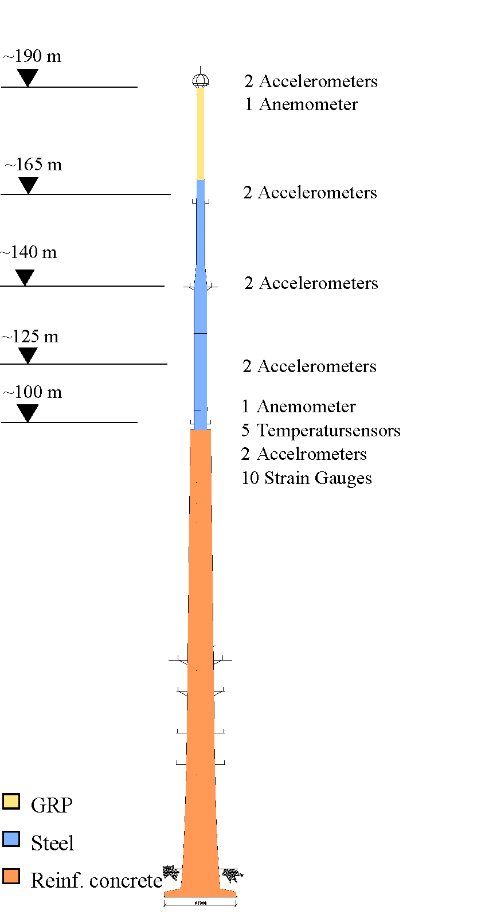
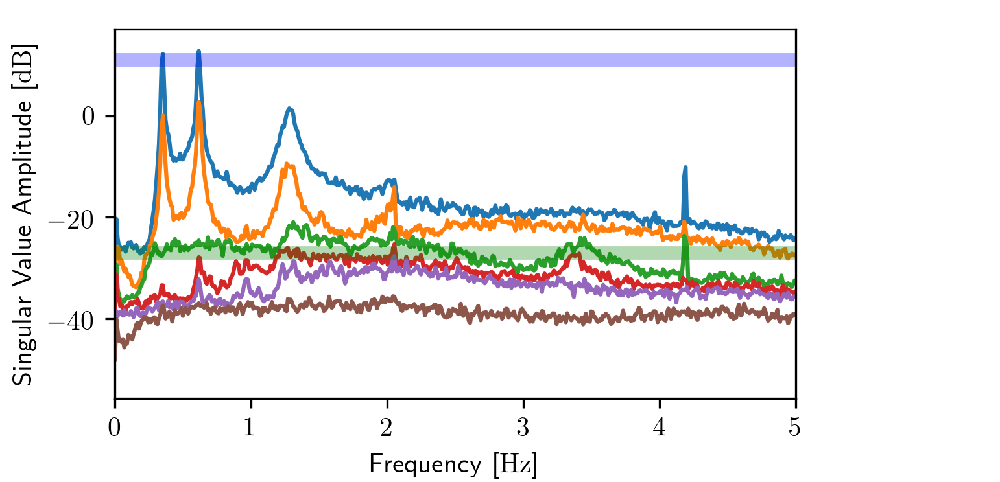
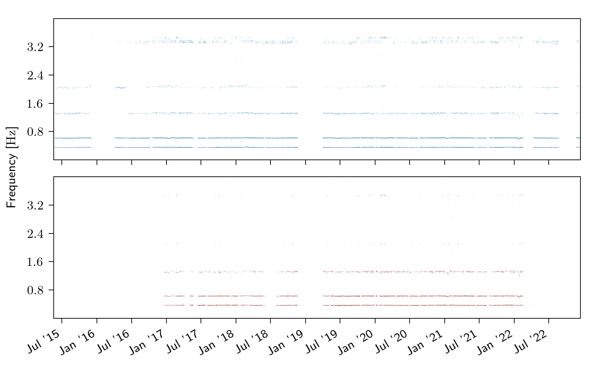
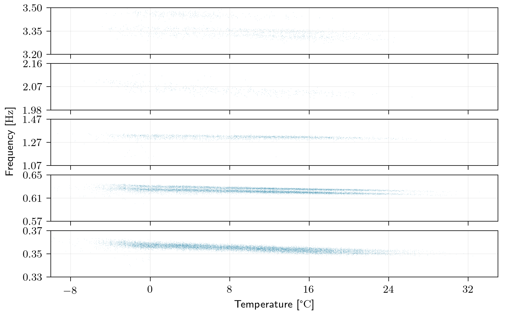
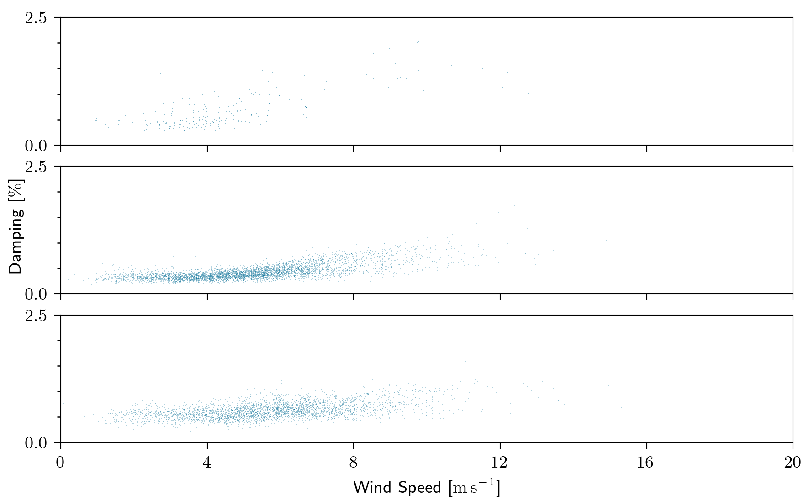

Continuous Structural Health Monitoring
========================================

This page describes how pyOMA has been deployed in a long-term continuous Structural
Health Monitoring (SHM) campaign for an approximately 190 m tall telecommunication tower
that has been in operation since 2015.  Acceleration (100 Hz) and fibre Bragg grating
(FBG) strain data (20 Hz), together with wind and temperature measurements, are
transmitted daily from the tower to a central server, where a fully automated pipeline
identifies five bending mode pairs in the frequency range 0.35–3.5 Hz and stores the
results in a time-indexed database.

Structure and instrumentation
------------------------------

The tower consists of three structural sections: a tapered prestressed concrete shaft at
the base, a tubular steel section in the middle, and a glass-fibre reinforced plastic
(GRP) cylinder at the top.  The tower's slender shape makes it susceptible to
wind-induced vibrations.  A tuned mass damper (TMD) — a steel–concrete ring of
approximately 1000 kg hanging on short pendulum rods — is installed at the top to
attenuate vibrations in the frequency range 1.5–2.5 Hz.

The monitoring system was installed in three stages over several years.  Piezoelectric
accelerometers measuring horizontal vibrations in two orthogonal directions are installed
in pairs at five height levels between approximately 100 m and 190 m.  Two ultrasonic
anemometers (at the top and at mid-height) and five PT100 temperature sensors record
environmental conditions.  In a later expansion stage, FBG strain rosettes were added at
the steel–concrete transition zone to capture local strains independently of the
accelerometer network.  All analog signals are digitised at distributed stations and
transmitted via fibre-optic link to a controller at ground level, from which data are
downloaded to a processing server once per day.

   Sensor layout of the telecommunication tower.  Accelerometer pairs are installed at
   five height levels (≈100–190 m); an anemometer and temperature sensors are mounted at
   ≈100 m; 10 FBG strain gauges are located at the steel–concrete transition zone.
   GRP = glass-fibre reinforced plastic.
   *(After Marwitz & Zabel, ISMA 2018.)*

Automated analysis pipeline
-----------------------------

The daily processing loop runs four stages automatically without human interaction.

**File ingestion and quality assessment**

Raw binary files are scanned on arrival; per-channel statistics (minimum, maximum, RMS,
kurtosis) are stored in a time-indexed file-info database.  Kurtosis serves as a quality
indicator: slices with measurement overloads or strongly non-Gaussian noise are flagged
and excluded from subsequent identification.

**Signal preprocessing**

Fixed-duration windows of 30 to 120 minutes are extracted from the continuous record.
A 4th-order Butterworth bandpass filter (0.1–5 Hz) is applied and signals are decimated
to 10 Hz before further processing.  The choice of window duration involves a
bias–variance trade-off: shorter windows capture rapid environmental changes but contain
fewer oscillation cycles per mode; 30-minute windows provide a good balance for this
structure [ISMA2018]_.

**Modal identification**

For each valid window, pyOMA's :class:`~pyOMA.core.VarSSIRef.VarSSIRef` estimator is run
and an automated stabilization procedure removes spurious poles without manual
interaction.  The preprocessor state and identified system are each cached to disk so
that, when the daily run is interrupted and restarted, already-processed windows are
skipped.

**Result storage**

Modal parameters (frequencies, damping ratios, mode shapes), signal statistics, and
environmental quantities are assembled into multidimensional sparse arrays and stored as
NetCDF files using `xarray <https://xarray.pydata.org>`_.  The three named dimensions
are **time**, **modes**, and **channels**.  All three are sparse: gaps arise from system
downtime, modes that are not sufficiently excited in a given window, and sensors that
fail or are replaced.  The sparse xarray structure handles these gaps transparently and
enables efficient filtering, correlation analysis, and visualisation [ISMA2018]_.

pyOMA integration
------------------

The modal identification stage is implemented entirely with pyOMA.  Below is a
condensed version of the core per-window workflow.

**1. Geometry and signal preprocessing**

.. code-block:: python

   from pyOMA.core.PreProcessingTools import GeometryProcessor, PreProcessSignals

   geometry = GeometryProcessor.load_geometry(
       nodes_file, lines_file, master_slaves_file
   )

   prep = PreProcessSignals(
       measurement,            # (n_samples × n_channels) ndarray
       sample_rate,
       ref_channels=[0, 1],   # reference channels for SSI
       accel_channels=list(range(n_channels)),
       channel_headers=headers,
       start_time=start_time,
   )
   chan_dofs = [
       [ch, node_id, angle, 0]
       for ch, (node_id, angle) in enumerate(sensor_map)
   ]
   prep.add_chan_dofs(chan_dofs)
   prep.sv_psd(n_lines, method='blackman-tukey', refs_only=False)

The singular-value power spectral density computed by
:meth:`~pyOMA.core.PreProcessingTools.PreProcessSignals.sv_psd` reveals peaks at the
natural frequencies before any identification is performed, providing a quick sanity
check on data quality:

   Singular-value power spectral density of a 30-minute acceleration record.  Peaks at
   approximately 0.35, 0.62, 1.3, 2.1, and 3.4 Hz correspond to the five bending mode
   pairs of the tower.  *(Marwitz & Zabel, ISMA 2018.)*

**2. State caching for uninterrupted batch runs**

.. code-block:: python

   from pathlib import Path

   if not Path(prep_cache).exists():
       prep.save_state(prep_cache)
   else:
       prep = PreProcessSignals.load_state(prep_cache)
       prep.sv_psd(n_lines, method='blackman-tukey', refs_only=False)

:meth:`~pyOMA.core.PreProcessingTools.PreProcessSignals.save_state` and
:meth:`~pyOMA.core.PreProcessingTools.PreProcessSignals.load_state` allow the pipeline
to resume after interruptions without recomputing the correlation functions.  The same
pattern applies to :class:`~pyOMA.core.VarSSIRef.VarSSIRef` and
:class:`~pyOMA.core.StabilDiagram.StabilCluster`.

**3. Identification**

.. code-block:: python

   from pyOMA.core.VarSSIRef import VarSSIRef

   modal = VarSSIRef.init_from_config(ssi_config_file, prep)
   modal.save_state(modal_cache)

:meth:`~pyOMA.core.VarSSIRef.VarSSIRef.init_from_config` reads block-line count, model
order range, and other SSI parameters from a plain-text config file, keeping tuning
parameters separate from the pipeline code.

**4. Automated stabilization**

.. code-block:: python

   from pyOMA.core.StabilDiagram import StabilCluster

   stabil = StabilCluster(modal, prep)
   stabil.calculate_soft_critera_matrices()
   stabil.calculate_stabilization_masks()
   stabil.automatic_clearing()
   stabil.automatic_classification()
   stabil.automatic_selection()

   freqs, damping, shapes, orders, *_ = stabil.return_results()

The three-stage automated procedure — clearing spurious poles, grouping similar poles
into clusters, and selecting the best representative per cluster — replaces the manual
stabilization diagram review that would otherwise be required for every 30-minute window.

Result storage with xarray
---------------------------

The output of :meth:`~pyOMA.core.StabilDiagram.StabilCluster.return_results` is
collected across time windows and stored as a sparse, self-describing NetCDF database
using `xarray <https://xarray.pydata.org>`_:

.. code-block:: python

   import numpy as np
   import xarray as xr

   # Build a single-window Dataset from return_results() output
   ds = xr.Dataset(
       {
           'frequency': (['time', 'mode'], freqs[np.newaxis, :]),
           'damping':   (['time', 'mode'], damping[np.newaxis, :]),
           # mode_shapes: (n_dofs × n_modes) → store per DOF if needed
       },
       coords={
           'time': [start_time],
           'mode': np.arange(len(freqs)),
       },
   )
   # Merge into the growing long-term database
   ds.to_netcdf(result_db_path, mode='a')

Results are **sparse along all three dimensions**:

- *time* — gaps from system downtime or discarded low-quality windows;
- *modes* — modes that are not excited in a given window are simply absent;
- *channels* — sensors that fail or are replaced introduce gaps in mode-shape data.

xarray's coordinate-aware indexing and built-in NaN handling make it straightforward to
select subsets (e.g. all windows above a minimum wind speed), compute rolling statistics,
and generate scatter plots without manually aligning index arrays.

Observations from long-term monitoring
----------------------------------------

**Frequency tracking over time**

   Identified natural frequencies over 7+ years (Jul 2015–Jul 2022).  *Top*:
   accelerometer data (blue); *bottom*: FBG strain data (red).  Five bending mode pairs
   are consistently identified; data gaps correspond to sensor maintenance periods.
   Strain-based identification starts in 2017 and reliably captures only the first three
   mode pairs due to the lower signal-to-noise ratio of strain measurements at higher
   frequencies.  *(Zabel & Marwitz, EVACES 2023.)*

**Temperature–frequency relationship**

Natural frequencies decrease approximately linearly with temperature across all mode
pairs, as shown below.  A decrease of about 2–3 % per 30 °C is consistent with
decreasing elastic moduli at higher temperatures.  The increased scatter below 0 °C is
attributed to icing events that temporarily add mass to the structure and lower the
natural frequencies by up to 10 % [EVACES2023]_.

   Identified natural frequencies vs. measured temperature for all five bending mode
   pairs (one panel per mode pair, bottom to top in ascending frequency order).
   *(Zabel & Marwitz, EVACES 2023.)*

**Wind speed–damping relationship**

Modal damping ratios increase with wind speed, as shown for the first three mode pairs.
The trend is attributed to aerodynamic damping and to stronger activation of the TMD at
higher vibration amplitudes [ISMA2018]_.

   Identified modal damping ratios vs. 10-minute mean wind speed for three bending mode
   pairs (stacked panels).  *(Zabel & Marwitz, EVACES 2023.)*

References
----------

.. [ISMA2018] Marwitz, S. and Zabel, V. (2018). "Relations between the quality of
   identified modal parameters and measured data obtained by structural monitoring."
   *Proc. International Conference on Noise and Vibration Engineering (ISMA 2018)*,
   Leuven, Belgium.

.. [EVACES2023] Zabel, V. and Marwitz, S. (2023). "Monitoring of the dynamic behaviour
   of a telecommunication tower." *Proc. Experimental Vibration Analysis for Civil
   Engineering Structures (EVACES 2023)*.

.. rubric:: See also

* :class:`~pyOMA.core.PreProcessingTools.GeometryProcessor` —
  geometry loading and channel-to-DOF mapping
* :class:`~pyOMA.core.PreProcessingTools.PreProcessSignals` —
  signal preprocessing, decimation, correlation, and SVD-PSD
* :class:`~pyOMA.core.VarSSIRef.VarSSIRef` —
  SSI with variance (uncertainty) estimation
* :class:`~pyOMA.core.StabilDiagram.StabilCluster` —
  automated pole clustering, clearing, and selection
* :class:`~pyOMA.core.StabilDiagram.StabilPlot` —
  stabilization diagram visualisation
