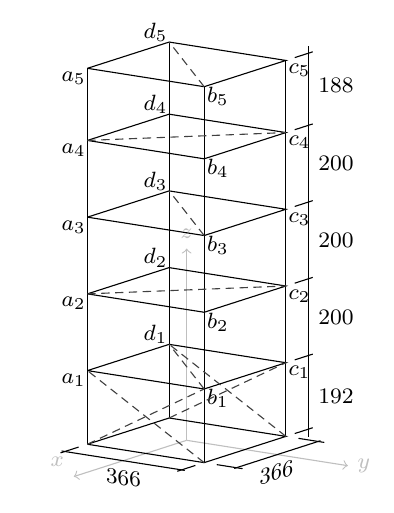
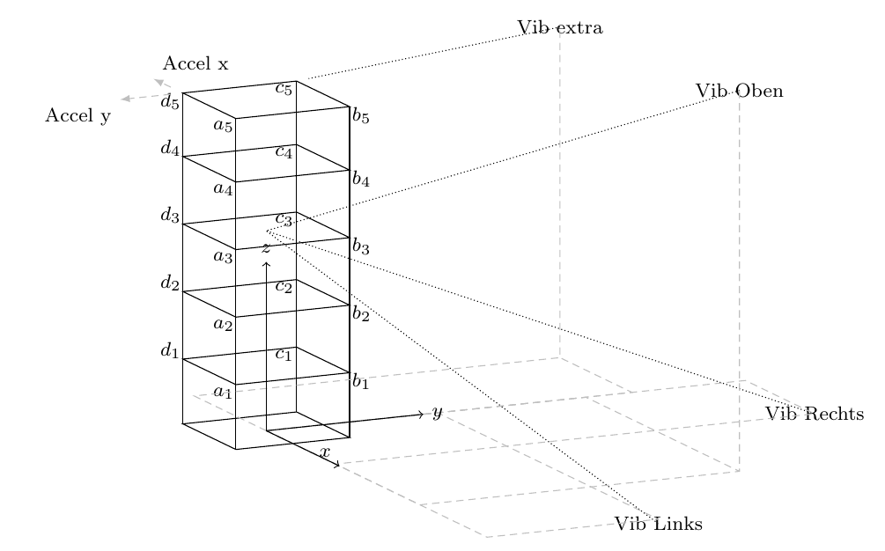

Example data: steel frame with 3D scanning laser vibrometer
=============================================================

All example scripts and notebooks in the ``scripts/`` directory use the same
measurement dataset, included in the repository under ``tests/files/``.
This page describes the test structure, the 3D laser vibrometer measurement
technique, and the multi-setup scan arrangement.

.. contents:: On this page
   :local:
   :depth: 2

Test structure
--------------

   Steel-frame test structure with axis/floor labelling (axes a–d, floors 1–5).

The test object is a slender steel-frame skeleton at the Institute of Structural
Mechanics (ISM), Bauhaus-Universität Weimar:

* **Height:** approx. 1 m
* **Base footprint:** 36 cm × 36 cm (square)
* **Columns:** four threaded rods M8 steel, one at each corner
* **Floors:** five horizontal platforms, each made of several 5 mm steel plates
  bolted between pairs of hex nuts — effectively clamped to the columns at each
  level
* **Boundary condition:** the lowest floor is bolted rigidly to a heavy wooden
  base plate (fixed-base condition)

The node labels follow the thesis convention: **axis** (*a–d*) × **floor** (*1–5*),
e.g. *a*:sub:`1` to *c*:sub:`5`, and *d*:sub:`5`.  The ``grid.txt`` file uses a
corresponding numbering scheme (nodes 1–24):

=====  ===========  ====================
Level  z (cm)       Nodes
=====  ===========  ====================
0      0            1 – 4  (base, fixed)
1      19.2         5 – 8
2      39.2         9 – 12
3      59.2         13 – 16
4      79.2         17 – 20
5      98.0         21 – 24
=====  ===========  ====================

Within each level the four nodes sit at the corners of the 36 cm × 36 cm square
(x, y = ±18.1 cm).  Node 24 (top of the far corner, axis *d*, floor 5) is the
permanent reference location.

**Asymmetric cross-bracing** is fitted at the lowest level in the *y*-direction
only, which separates the first bending modes in *x* and *y* and avoids
degenerate (coupled) mode pairs.  The structure exhibits at least eight clearly
identifiable vibration modes below 15 Hz: first and second bending in *x* and
*y*, first and second torsion, and a longitudinal mode.

Ambient excitation
------------------

The structure was excited by two electric fans placed on either side, providing
broadband aerodynamic (output-only) excitation.  No force measurement was made
— the classical OMA scenario.

3D scanning laser vibrometer
-----------------------------

   Arrangement of the three PSV 400-3D scan heads (left, right, top) and the
   accelerometer reference sensors at node *d*:sub:`5`.

The measurements were performed with a **Polytec PSV 400-3D** system: three
scanning laser Doppler vibrometer (LDV) heads, each independently steerable.

Measurement principle
~~~~~~~~~~~~~~~~~~~~~

A laser Doppler vibrometer measures instantaneous vibration velocity by
detecting the Doppler frequency shift of the laser light reflected from a moving
surface.  Because the Doppler shift is caused only by the component of velocity
*along the beam axis*, **each head measures only the projection of the true 3-D
vibration vector onto its own beam direction**:

.. math::

   v_\text{meas} = \mathbf{e}(\alpha,\beta)^\top \mathbf{v},
   \qquad
   \mathbf{e}(\alpha,\beta) =
   \begin{pmatrix}
     \cos\beta\,\cos\alpha \\
     \cos\beta\,\sin\alpha \\
     \sin\beta
   \end{pmatrix}

where **e** is the unit vector along the beam, *α* is the azimuth and *β* is the
elevation angle.  With three heads aimed from different directions, the three
simultaneous measurements form a system of equations that can be solved for the
three Cartesian velocity components — provided the beams are not coplanar.

Skewed (oblique) measurement directions
~~~~~~~~~~~~~~~~~~~~~~~~~~~~~~~~~~~~~~~~

In the dataset the three heads are positioned in front of the structure so that
beams converge approximately on each measurement node.  Because the heads are at
a finite distance and offset to the sides and above, **all beams arrive at
oblique angles** — none of the three coincides with a global Cartesian axis:

.. list-table::
   :header-rows: 1
   :widths: 20 30 30

   * - Channel
     - Azimuth (approx.)
     - Elevation (approx.)
   * - vib_l (left head)
     - 15 – 29 °
     - −18 – −9 °
   * - vib_r (right head)
     - 79 – 81 °
     - −17 – −7 °
   * - vib_t (top head)
     - 46 – 56 °
     - +28 – +35 °

The exact angles for each setup and node are stored in the per-setup
``channel_dofs.txt`` file and are read by
:class:`~pyOMA.core.PreProcessingTools.PreProcessSignals` via the ``chan_dofs``
attribute.  They are later used by
:class:`~pyOMA.core.PlotMSH.ModeShapePlot` to project the identified mode
shapes from the oblique measurement coordinate system back to global Cartesian
for visualisation.

.. note::

   In OMA you do **not** need to transform time series to orthogonal Cartesian
   coordinates before system identification.  Identification operates on the
   oblique (laser-direction) channels directly.  The transformation to *x/y/z*
   happens afterwards during mode-shape post-processing using the stored
   azimuth/elevation angles.

Reference sensors
~~~~~~~~~~~~~~~~~

Two piezoelectric accelerometers are permanently mounted on **node 24**
(*d*:sub:`5`, the highest corner of the back column) and are oriented along the
global *x* and *y* axes.  They serve as fixed reference channels across all 15
setups, enabling PoSER and PoGER merging:

* **Channel 3** — accelerometer, node 24, x-direction (azimuth 0°, elevation 180°)
* **Channel 4** — accelerometer, node 24, y-direction (azimuth −90°, elevation 0°)
* **Channel 5** — accelerometer, node 24, z-direction — present in raw data but
  excluded from the analysis (``Delete Channels: 5`` in ``setup_info.txt``)

Multi-setup scan arrangement
-----------------------------

The 3D-SLDV scans **one node at a time**: all three laser heads point
simultaneously at a single node, record for the measurement duration, then the
heads are re-aimed at the next node.  The complete dataset covers 15 setups,
scanning nodes 5 – 19 (floors 1 – 4) in sequence:

.. list-table::
   :header-rows: 1
   :widths: 10 10 50 30

   * - Setup
     - Node
     - Active rover channels
     - Floor / height
   * - 1
     - 5
     - vib_l, vib_r, vib_t (+ ref_x, ref_y)
     - Floor 1 / 19.2 cm
   * - 2
     - 6
     - vib_l, vib_r, vib_t (+ ref_x, ref_y)
     - Floor 1 / 19.2 cm
   * - 3
     - 7
     - vib_l, vib_r, vib_t (+ ref_x, ref_y)
     - Floor 1 / 19.2 cm
   * - …
     - …
     - …
     - …
   * - 15
     - 19
     - vib_l, vib_r, vib_t (+ ref_x, ref_y)
     - Floor 4 / 79.2 cm

Each setup directory ``tests/files/measurement_<n>/`` contains:

* ``measurement_<n>.npy`` — raw time series, shape *(n_samples × 6)*, columns 0–5
* ``setup_info.txt`` — sampling rate (256 Hz), reference channels, channel-type assignments
* ``channel_dofs.txt`` — per-channel node, azimuth, elevation, and label
* ``prep_data.npz``, ``modal_data.npz``, ``stabil_data.npz`` — pre-computed
  intermediate results for fast loading during testing

**Measurement parameters:**

======================  ==================
Sampling rate           256 Hz (pre-recorded)
Duration per setup      ≈ 256 s
Decimation in scripts   ×3 then ×3 → ≈ 28.4 Hz effective
Correlation lags        401 (``m_lags`` parameter)
======================  ==================

Relation to the example scripts
---------------------------------

.. list-table::
   :header-rows: 1
   :widths: 45 55

   * - Script / Notebook
     - What it does with this data
   * - :doc:`_collections/single_setup_analysis`
     - Analyses only ``measurement_1`` in isolation (SSI-cov/ref, one setup)
   * - :doc:`_collections/multi_setup_analysis`
     - Runs SSI independently on each of the 15 setups, then merges the
       estimated modal parameters with
       :class:`~pyOMA.core.PostProcessingTools.MergePoSER`
   * - :doc:`_collections/multi_setup_analysis_poger`
     - Stacks the correlation matrices from all 15 setups into a joint
       block-Hankel matrix and runs a single SSI via
       :class:`~pyOMA.core.SSICovRef.PogerSSICovRef`
