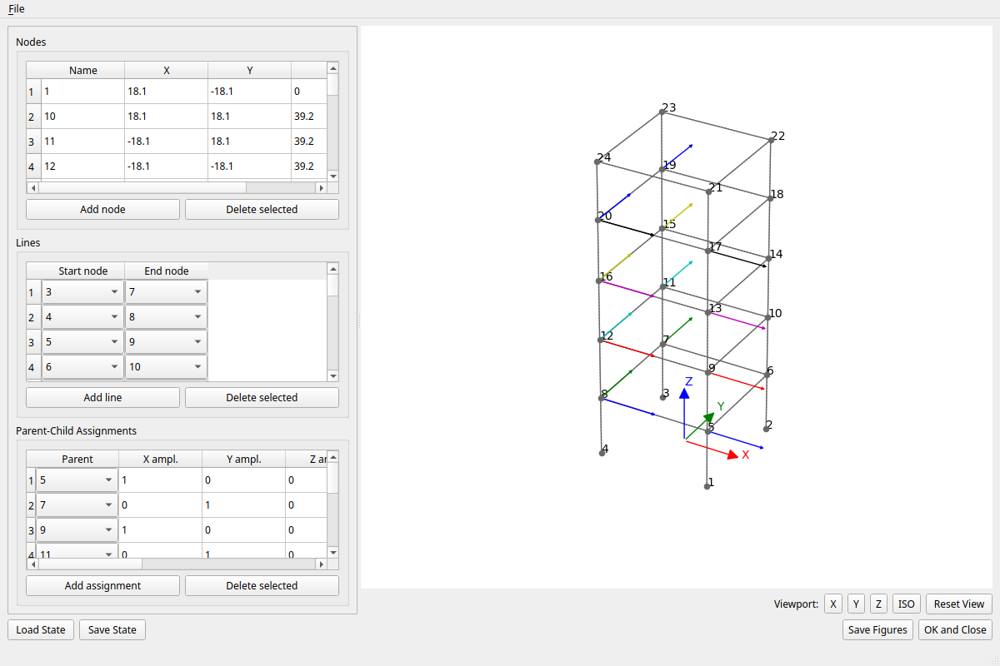
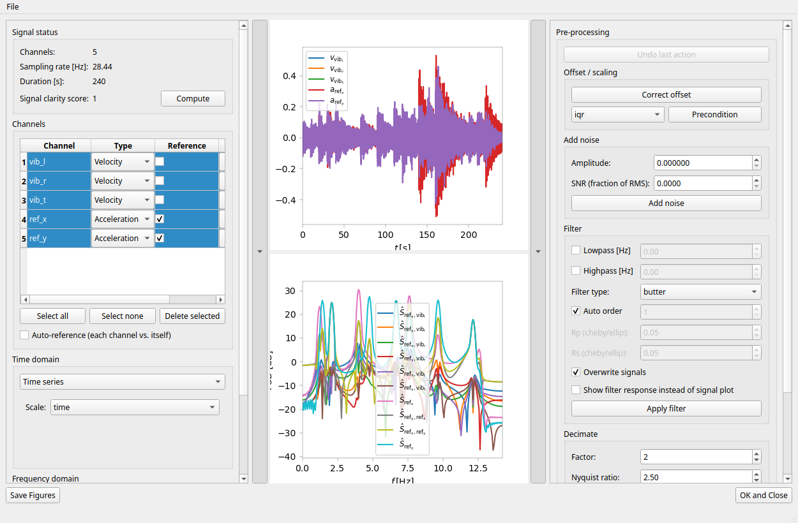
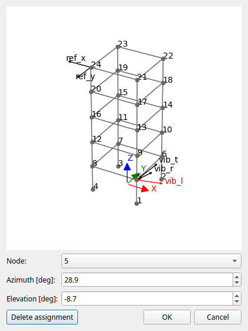
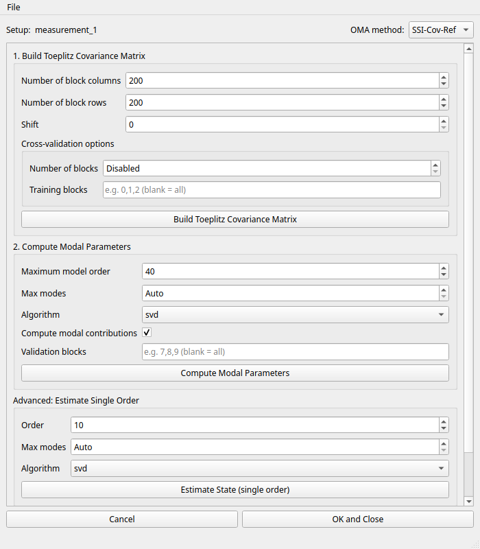
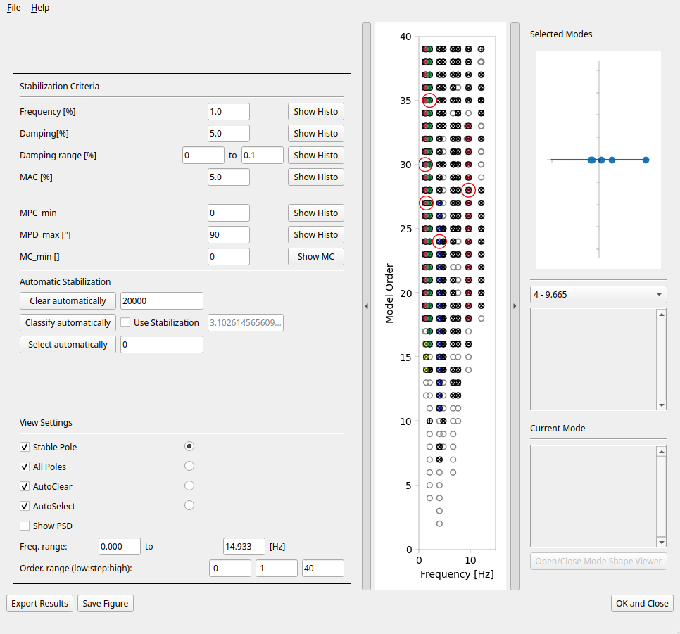
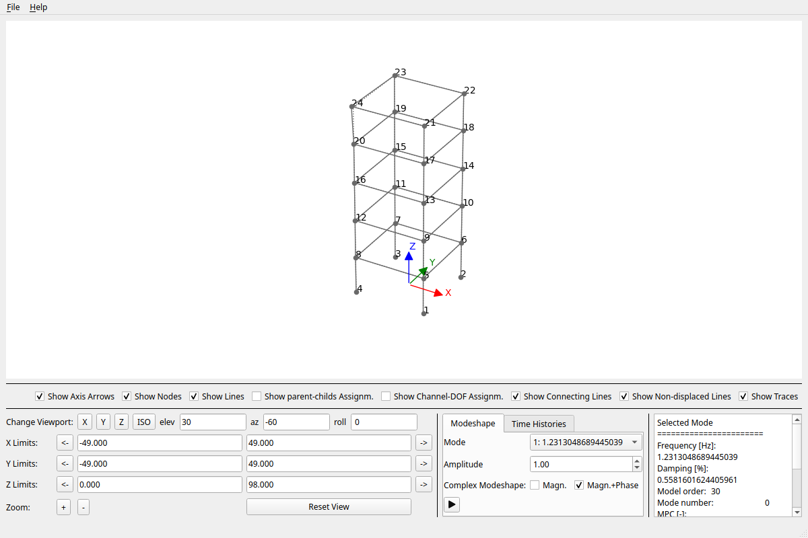

GUI Usage
==========

This page walks through every window of pyOMA's desktop GUI, in the order you
would normally open them. Screenshots are generated from the bundled
steel-frame example data (see :doc:`example_data`) by
``scripts/generate_gui_screenshots.py`` — run that script and commit the
result whenever a GUI window's layout changes, so these images never go
stale (see :doc:`gui_development` for the full workflow).

.. contents:: On this page
   :local:
   :depth: 2

Overview
--------

pyOMA has two interactive frontends:

* **PyQt6 desktop GUI** (this page) — standalone windows, installed with
  ``pip install -e ".[gui]"``. Covers the whole workflow: geometry editing,
  signal pre-processing, system identification, stabilisation, and mode-shape
  visualisation.
* **Jupyter/ipywidgets GUI** — inline notebook widgets, installed with
  ``pip install -e ".[jupyter]"``. Covers stabilisation and mode-shape
  visualisation only. See :ref:`gui_usage-jupyter` below.

Both wrap the same underlying classes described in :doc:`getting_started`;
neither is required to use pyOMA — everything is also directly scriptable, as
that page shows.

Recommended way to explore: single_setup_analysis_gui_only.py
-----------------------------------------------------------------

The quickest way to see every window below, interactively, against the
bundled example data:

.. code-block:: bash

   python scripts/single_setup_analysis_gui_only.py

Unlike ``scripts/single_setup_analysis.py`` (which pre-computes decimation,
correlation, and identification parameters in code and only *optionally*
opens a GUI afterwards, via its ``SHOW_*_GUI`` flags), the ``_gui_only``
variant makes every one of those decisions interactively — you pick the
decimation factor, correlation/PSD parameters, identification method, and
stabilisation thresholds inside the GUIs themselves. What remains scripted is
only what has no GUI equivalent yet: loading the initial measurement and
wiring one GUI's output into the next one's input.

1. Geometry — GeometryProcessorGUI
------------------------------------

   **Geometry editor** — add/edit/delete nodes, structural lines, and
   parent-child (oblique-DOF decomposition) assignments, with a live 3-D
   preview. Wraps :class:`~pyOMA.core.PreProcessingTools.GeometryProcessor`.

Launch standalone with :func:`~pyOMA.GUI.GeometryProcessorGUI.start_geometry_processor_gui`.
This step is optional — skip it if you only need numerical results, not
mode-shape visualisation.

2. Signal pre-processing — PreProcessSignalsGUI
---------------------------------------------------

   **Signal pre-processing** — channel table (type, reference flag, rename,
   delete), time-series/PSD/correlation plots, and controls for offset
   correction, filtering, and decimation. Wraps
   :class:`~pyOMA.core.PreProcessingTools.PreProcessSignals` and
   :class:`~pyOMA.core.PreProcessingTools.SignalPlot`.

Launch standalone with :func:`~pyOMA.GUI.PreProcessSignalsGUI.start_preprocess_gui`.

Channel-DOF assignment — ChanDofEditorGUI
~~~~~~~~~~~~~~~~~~~~~~~~~~~~~~~~~~~~~~~~~~~~

   **Channel-DOF editor** — opened via the channel table's "Add DOF" button
   (or by double-clicking an assigned channel); picks the node a channel
   measures at and its azimuth/elevation, with a live 3-D preview of the
   resulting sensor direction.

3. System identification — ModalAnalysisGUI
-----------------------------------------------

   **System identification** — a method selector and a build/compute page
   per method, applied to the same pre-processed signals. Shown here on the
   SSI-Cov-Ref page after both build steps have run. Launch standalone with
   :func:`~pyOMA.GUI.ModalAnalysisGUI.start_modal_analysis_gui`.

Every method page follows the same pattern: fill in the parameters for each
step, click the step's button, then click "Save State..."/"Load State..." to
persist or restore the underlying object. See :doc:`getting_started`'s
Step-4 table for when to choose each method. The other four pages —
**SSI-Data** (:class:`~pyOMA.core.SSIData.SSIData` family: SSI-Data,
SSI-Data/MC, SSI-Data/CV, picked via a variant combo box), **Var-SSI-Ref**
(:class:`~pyOMA.core.VarSSIRef.VarSSIRef`, an extra "prepare sensitivities"
step for uncertainty quantification), **pLSCF**
(:class:`~pyOMA.core.PLSCF.PLSCF`), and **PRCE**
(:class:`~pyOMA.core.PRCE.PRCE`, requires at least 2 reference channels) —
share this same two-or-more-step build/compute layout with method-specific
parameters.

4. Stabilisation diagram — StabilGUI
-----------------------------------------

   **Stabilisation diagram** — adjustable stabilisation criteria, automatic
   pole clearing/classification/selection, and a mode-value inspector. Wraps
   :class:`~pyOMA.core.StabilDiagram.StabilPlot` and
   :class:`~pyOMA.core.StabilDiagram.StabilCluster`. Launch standalone with
   :func:`~pyOMA.GUI.StabilGUI.start_stabil_gui`.

Clicking a pole (or stepping through the mode selector once modes are
selected) updates the display of the complex-plane.

5. Mode-shape animation — ModeShapeGUI
-------------------------------------------

   **Mode-shape viewer** — animated 3-D mode shapes with amplitude scaling,
   node/line/trace visibility toggles, and per-mode frequency/damping/order
   information. Wraps :class:`~pyOMA.core.PlotMSH.ModeShapePlot`. Launch
   standalone with :func:`~pyOMA.GUI.PlotMSHGUI.start_msh_gui`.

This same viewer is also embedded live inside :class:`~pyOMA.GUI.StabilGUI.StabilGUI`
(pass ``msh_plot`` to ``start_stabil_gui``) so the mode shape updates
immediately as you select poles — the screenshot above shows it standalone,
with its full control panel.

.. _gui_usage-jupyter:

Jupyter/ipywidgets alternative
------------------------------------

For notebook-based work, :mod:`pyOMA.GUI.JupyterGUI` provides inline
equivalents of the stabilisation diagram and mode-shape viewer, plus a config
file editor:

.. code-block:: python

   from IPython.display import display
   from pyOMA.GUI.JupyterGUI import StabilGUIWeb, PlotMSHWeb, ConfigGUIWeb

   widget, cursor = StabilGUIWeb(stabil_plot)
   display(widget)

   display(PlotMSHWeb(mode_shape_plot))

See :doc:`getting_started` for installation (``pip install -e ".[jupyter]"``)
and the worked example notebooks under :doc:`examples`.
