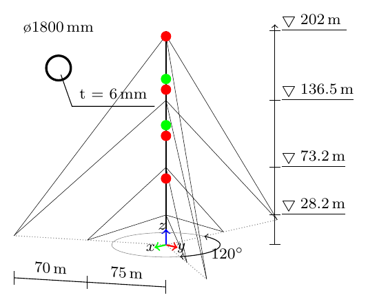
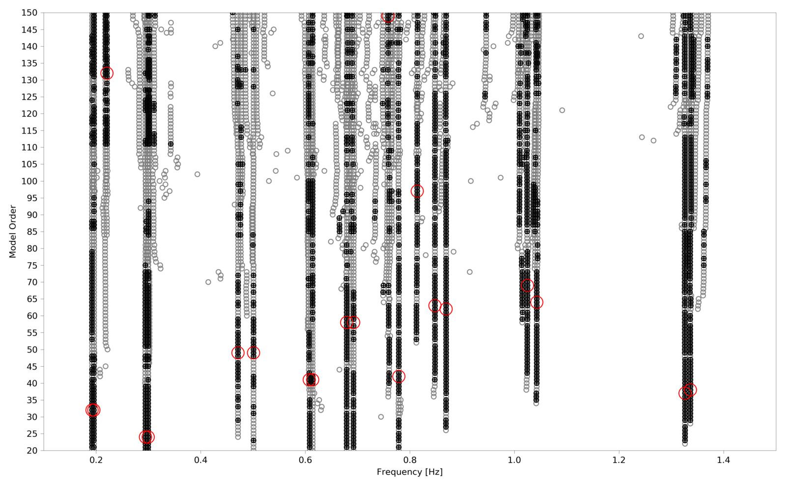
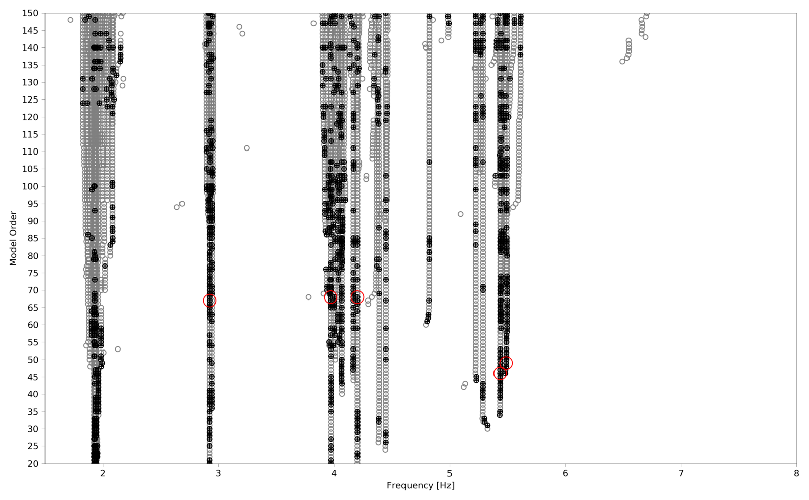

Multi-Setup PoGER Analysis of a Guyed Mast
============================================

This page describes how pyOMA has been applied to an ambient-vibration
measurement campaign on a guyed steel-tube telecommunication mast, using the
covariance-driven, reference-based Stochastic Subspace Identification method
(SSI-cov-ref) merged across several measurement setups with the **PoGER**
(Post Global Estimation Re-scaling) strategy. Guyed masts are a challenging
case for operational modal analysis: the three-fold rotational symmetry of a
typical guying arrangement produces closely spaced pairs of bending modes in
near-orthogonal directions, and the strongly nonlinear, temperature- and
amplitude-dependent stiffness of the guy cables raises the question of
whether a linear, time-invariant identification method can meaningfully
describe the structure's dynamics at all.

Structure and instrumentation
-------------------------------

The mast is a steel tube of tubular cross-section, approximately 197 m tall, stabilized by guy
cables arranged in three lanes at 120° azimuthal spacing and attached at four
stay levels along the height. Ambient vibrations were measured with
piezoelectric accelerometers (PCB 393B31) recording two horizontal,
orthogonal directions at 14 measurement points along the mast, sampled at
128 Hz for 30 minutes per setup. Two sensor pairs at fixed reference
positions remained in place throughout the campaign; four additional roving
sensor pairs were moved between three measurement setups to cover the full
height of the mast.

Measurement campaign
----------------------

The three roving setups (referred to here as Setup 1, 2, and 3) together
cover 14 measurement points at 2 orthogonal horizontal directions each. A
second campaign variant additionally instrumented the guy cables themselves
at their four stay levels, adding four more setups analyzed the same way —
this "cables" variant is not detailed further here, but uses an identical
pyOMA workflow.

   Mast elevation drawing, cycling through the three measurement setups.
   Green markers are the two fixed reference sensor pairs; red markers are
   the four roving sensor pairs, repositioned between setups to cover the
   full mast height.

Because modal density was very high below approximately 1.5 Hz, the
frequency range was split and processed in two separate passes: a low-
frequency band (0.1–1.5 Hz) and a high-frequency band (1.5–8 Hz), each with
its own bandpass filter, decimation factor, and correlation-function lag
count, sized to resolve that band's mode count with an adequate number of
block rows in the SSI Hankel matrix.

pyOMA integration
-------------------

The identification is implemented with pyOMA's :class:`~pyOMA.core.SSICovRef.PogerSSICovRef`,
which merges the setups *before* the state-space identification step rather
than merging separately identified mode shapes afterwards (the alternative
**PoSER** — Post Separate Estimation Re-scaling — approach implemented in
:class:`~pyOMA.core.PostProcessingTools.MergePoSER`). PoGER was chosen here to
reduce the manual identification effort across the many setups of the full
campaign.

**1. Geometry and per-setup preprocessing**

.. code-block:: python

   import numpy as np
   from pyOMA.core.PreProcessingTools import GeometryProcessor, PreProcessSignals
   from pyOMA.core.SSICovRef import PogerSSICovRef

   geometry = GeometryProcessor.load_geometry(nodes_file, lines_file)

   # raw measurements are plain ASCII column files
   PreProcessSignals.load_measurement_file = np.loadtxt

   poger = PogerSSICovRef()
   for conf_file, meas_file, chan_dofs_file in setups:
       prep = PreProcessSignals.init_from_config(
           conf_file, meas_file, chan_dofs_file,
       )
       prep.filter_signals(highpass=0.1, lowpass=1.5)
       prep.decimate_signals(5)
       prep.decimate_signals(5)          # combined decimation factor 25 -> ~5.1 Hz
       prep.correlation(m_lags=422)       # >= 2 * num_block_rows + 2
       poger.add_setup(prep)

Each setup's :class:`~pyOMA.core.PreProcessingTools.PreProcessSignals` object
is built via :meth:`~pyOMA.core.PreProcessingTools.PreProcessSignals.init_from_config`,
which reads the sampling rate, reference/roving channel indices, and sensor
axis assignment from a plain-text per-setup configuration file, keeping
per-setup metadata out of the analysis code.

**2. PoGER merging and identification**

.. code-block:: python

   poger.pair_channels()
   poger.build_merged_subspace_matrix(num_block_columns=210)
   poger.compute_modal_params(max_model_order=200)

:meth:`~pyOMA.core.SSICovRef.PogerSSICovRef.pair_channels` matches degrees of
freedom that are common to all setups (the fixed reference sensor pairs) and
uses them to rescale each setup's partial mode shapes onto a single common
reference by joint least squares — no per-setup single-setup identification
is needed before merging.

**3. Stabilization**

.. code-block:: python

   from pyOMA.core.StabilDiagram import StabilCluster

   stabil = StabilCluster(poger)
   stabil.calculate_soft_critera_matrices()
   stabil.calculate_stabilization_masks(
       d_range=(0.01, 1), mpc_min=0.5, mpd_max=30,
       df_max=0.001, dd_max=0.1, dmac_max=0.001,
   )
   stabil.automatic_selection()

The stabilization thresholds above are the ones used for this dataset;
:meth:`~pyOMA.core.StabilDiagram.StabilCluster.automatic_selection` performs
an unsupervised clearing/clustering/selection pass, though the original study
selected modes interactively via the stabilization-diagram GUI instead.

   Stabilization diagram for the low-frequency band (0.1–1.5 Hz). Gray
   circles are identified poles at each model order; black-filled circles
   passed the stability criteria; red circles mark the poles selected as
   physical modes.

   Stabilization diagram for the high-frequency band (1.5–8 Hz), same
   convention as above.

**4. Mode-shape visualization**

.. code-block:: python

   from pyOMA.core.PlotMSH import ModeShapePlot

   mode_shape_plot = ModeShapePlot(
       geometry_data=geometry, modal_data=poger, stabil_calc=stabil,
       prep_signals=poger.prep_signals, amplitude=10,
   )
   mode_shape_plot.save_plot('mode_shape.png')

Results
--------

30 modes were identified up to approximately 5.5 Hz. As expected from the
mast's three-fold rotationally symmetric guying arrangement, modes appear in
closely spaced pairs vibrating in near-orthogonal directions — visible below
as pairs of near-identical frequencies with principal directions roughly
90° apart. In addition to the frequency and damping ratio estimated directly
by pyOMA, the study computed a **principal vibration direction** (α) for
each mode — the azimuth of the major axis of the (generally elliptical)
horizontal displacement orbit, obtained via a custom orthogonal
least-squares fit of the two horizontal mode-shape components. This
direction analysis is domain-specific post-processing beyond pyOMA's
built-in API.

The animations below show the identified deformation of the first six mode
pairs (modes 1–6 and 13–18), each looping over one oscillation cycle:

.. list-table::
   :widths: 50 50

   * - .. image:: _static/guyed_mast_mode_01.gif
          :width: 100%

       **Mode 1** — f = 0.196 Hz, ζ = 0.47 %, α = 41°
     - .. image:: _static/guyed_mast_mode_02.gif
          :width: 100%

       **Mode 2** — f = 0.192 Hz, ζ = 0.48 %, α = 117°
   * - .. image:: _static/guyed_mast_mode_03.gif
          :width: 100%

       **Mode 3** — f = 0.295 Hz, ζ = 0.34 %, α = 151°
     - .. image:: _static/guyed_mast_mode_04.gif
          :width: 100%

       **Mode 4** — f = 0.300 Hz, ζ = 0.27 %, α = 64°
   * - .. image:: _static/guyed_mast_mode_05.gif
          :width: 100%

       **Mode 5** — f = 0.471 Hz, ζ = 0.62 %, α = 133°
     - .. image:: _static/guyed_mast_mode_06.gif
          :width: 100%

       **Mode 6** — f = 0.501 Hz, ζ = 0.37 %, α = 52°
   * - .. image:: _static/guyed_mast_mode_13.gif
          :width: 100%

       **Mode 13** — f = 0.848 Hz, ζ = 0.50 %, α = 31°
     - .. image:: _static/guyed_mast_mode_14.gif
          :width: 100%

       **Mode 14** — f = 0.869 Hz, ζ = 0.22 %, α = 116°
   * - .. image:: _static/guyed_mast_mode_15.gif
          :width: 100%

       **Mode 15** — f = 1.024 Hz, ζ = 0.47 %, α = 46°
     - .. image:: _static/guyed_mast_mode_16.gif
          :width: 100%

       **Mode 16** — f = 1.043 Hz, ζ = 0.25 %, α = 137°
   * - .. image:: _static/guyed_mast_mode_17.gif
          :width: 100%

       **Mode 17** — f = 1.326 Hz, ζ = 0.29 %, α = 102°
     - .. image:: _static/guyed_mast_mode_18.gif
          :width: 100%

       **Mode 18** — f = 1.336 Hz, ζ = 0.23 %, α = 5°

The complete set of 30 identified modes is listed below.

.. list-table:: Identified modal parameters
   :header-rows: 1
   :widths: 10 15 15 15

   * - Mode
     - f [Hz]
     - ζ [%]
     - α [°]
   * - 1
     - 0.196
     - 0.466
     - 41.13
   * - 2
     - 0.192
     - 0.479
     - 117.14
   * - 3
     - 0.295
     - 0.338
     - 151.25
   * - 4
     - 0.300
     - 0.269
     - 63.79
   * - 5
     - 0.471
     - 0.615
     - 132.52
   * - 6
     - 0.501
     - 0.365
     - 52.19
   * - 7
     - 0.609
     - 0.189
     - 24.63
   * - 8
     - 0.614
     - 0.207
     - 106.23
   * - 9
     - 0.679
     - 0.185
     - 15.72
   * - 10
     - 0.692
     - 0.310
     - 103.23
   * - 11
     - 0.779
     - 0.426
     - 87.16
   * - 12
     - 0.814
     - 0.285
     - 159.03
   * - 13
     - 0.848
     - 0.495
     - 31.24
   * - 14
     - 0.869
     - 0.224
     - 116.13
   * - 15
     - 1.024
     - 0.468
     - 45.90
   * - 16
     - 1.043
     - 0.253
     - 137.08
   * - 17
     - 1.326
     - 0.291
     - 102.40
   * - 18
     - 1.336
     - 0.227
     - 4.95
   * - 19
     - 1.930
     - 0.307
     - 181.20
   * - 20
     - 1.937
     - 0.111
     - 93.56
   * - 21
     - 2.924
     - 0.346
     - 130.87
   * - 22
     - 2.942
     - 0.495
     - 35.56
   * - 23
     - 3.972
     - 0.550
     - 54.87
   * - 24
     - 4.201
     - 0.276
     - 55.87
   * - 25
     - 3.973
     - 0.553
     - 52.35
   * - 26
     - 4.200
     - 0.195
     - 1.41
   * - 27
     - 4.390
     - 0.385
     - 114.28
   * - 28
     - 4.449
     - 0.267
     - 33.29
   * - 29
     - 5.439
     - 0.494
     - 69.28
   * - 30
     - 5.494
     - 0.673
     - 152.53

References
-----------

.. [BAUSTATIK2020] Zabel, V., Marwitz, S., and Habtemariam, A. (2020).
   "Bestimmung von modalen Parametern seilabgespannter Rohrmasten."
   *Baustatik-Baupraxis*.

.. rubric:: See also

* :class:`~pyOMA.core.PreProcessingTools.GeometryProcessor` —
  geometry loading and channel-to-DOF mapping
* :class:`~pyOMA.core.PreProcessingTools.PreProcessSignals` —
  signal preprocessing, filtering, decimation, and correlation estimation
* :class:`~pyOMA.core.SSICovRef.PogerSSICovRef` —
  multi-setup covariance-driven SSI with PoGER merging
* :class:`~pyOMA.core.PostProcessingTools.MergePoSER` —
  the alternative PoSER multi-setup merging strategy
* :class:`~pyOMA.core.StabilDiagram.StabilCluster` —
  automated pole clustering, clearing, and selection
* :class:`~pyOMA.core.PlotMSH.ModeShapePlot` —
  3-D mode-shape visualization
