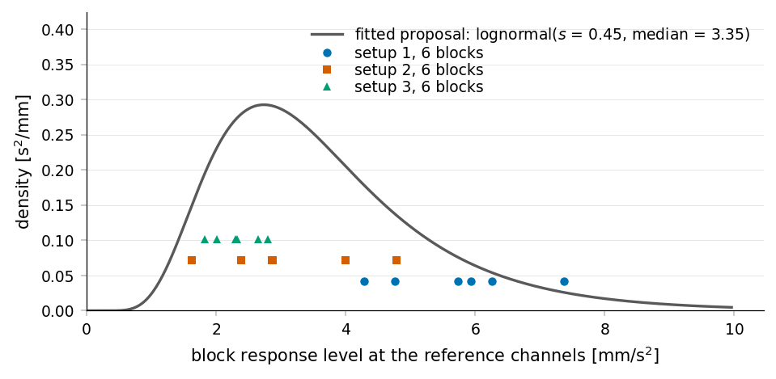
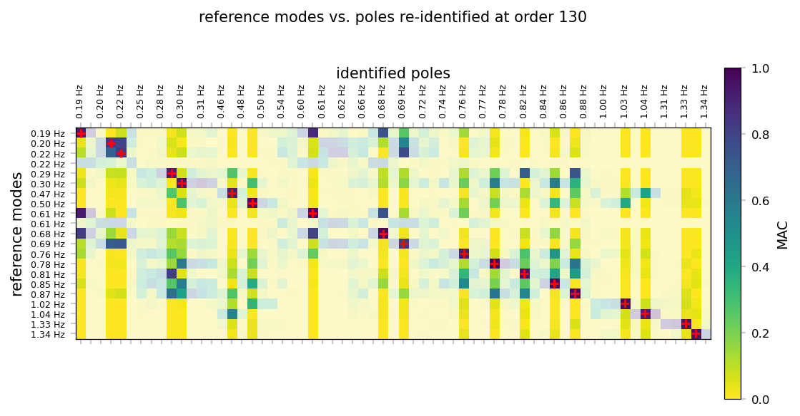
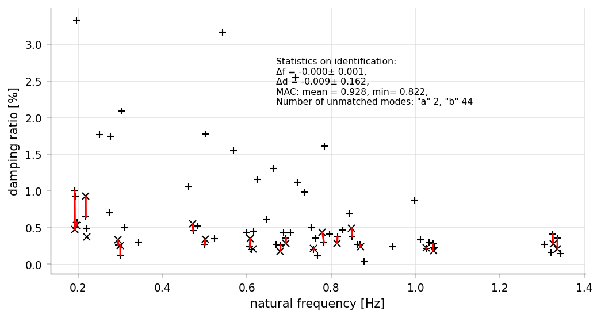
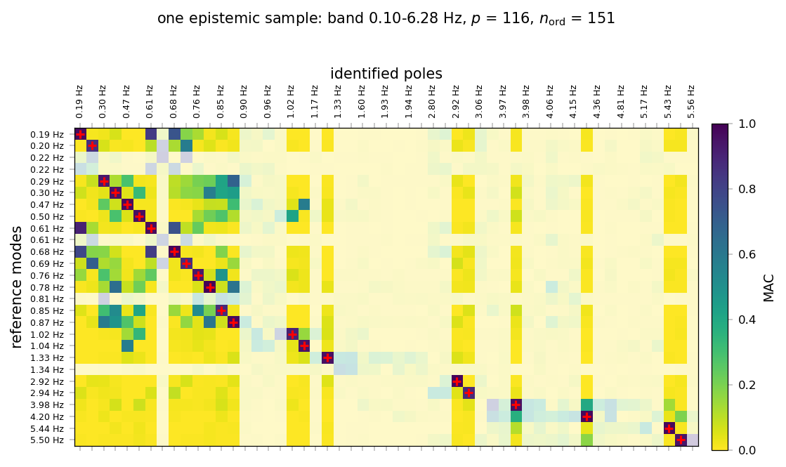
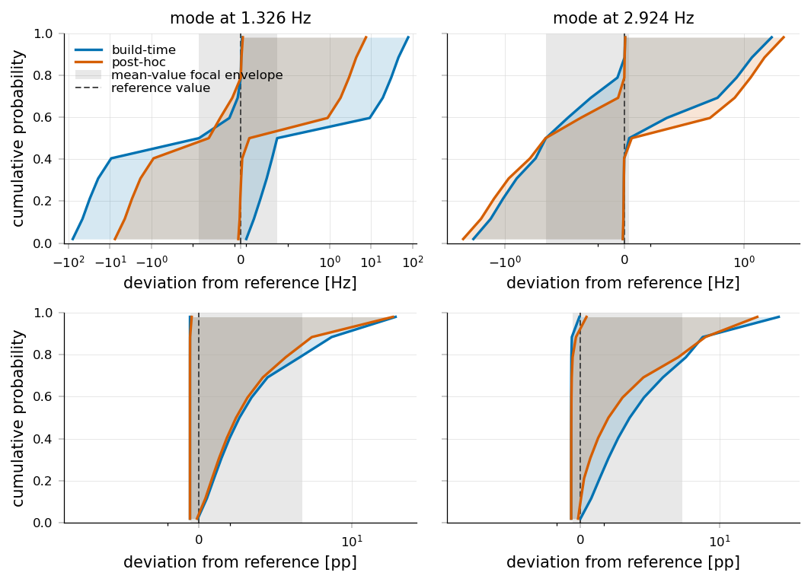
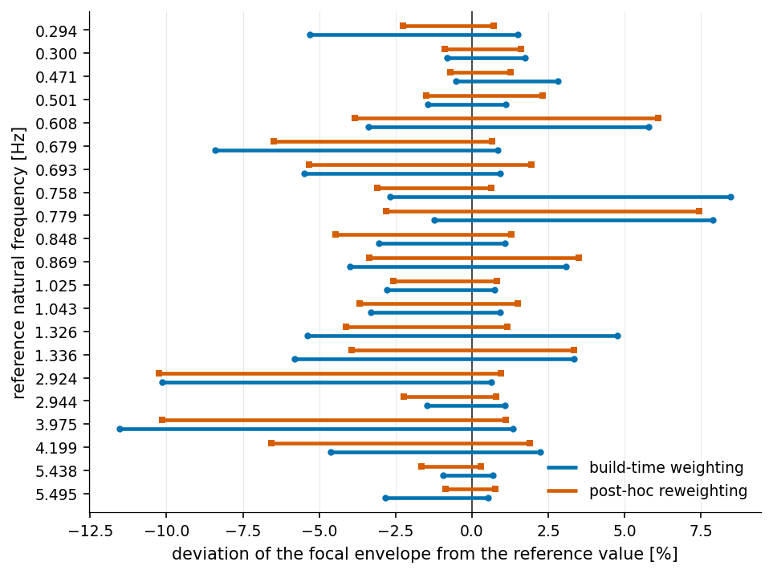
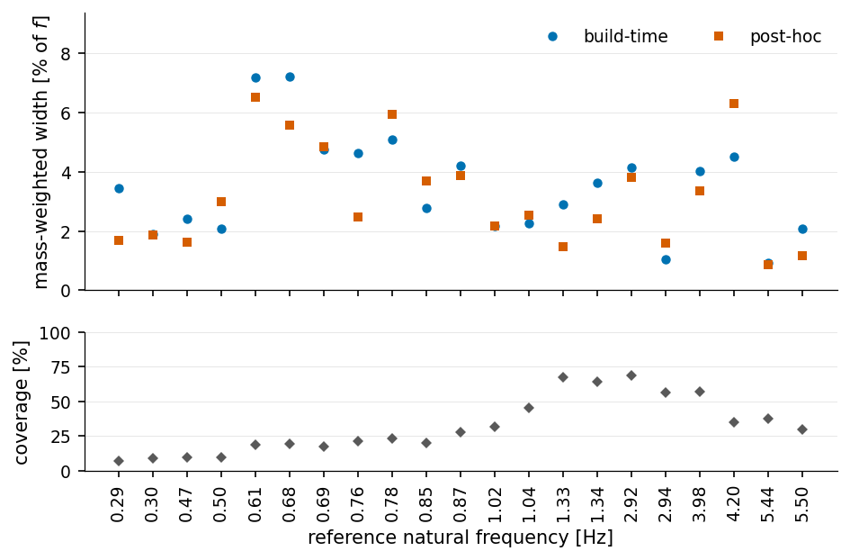

Polymorphic Uncertainty Quantification of a Guyed-Mast Identification
======================================================================

The :doc:`guyed_mast_multisetup` page identifies the modes of a 197 m guyed
mast from three ambient measurement setups. That analysis makes a long series
of choices — the analysis band, the decimation factor, the number of
correlation lags, the model order, which poles are physical — and every one of
them is defensible without being uniquely correct. Change the band edge by a
few tenths of a hertz and a mode may appear, disappear, or shift.

This page documents the same campaign analysed a second way: instead of picking
one value for each of those choices, they are declared as **uncertain
variables** and propagated through the identification, so the result is an
interval per modal parameter rather than a number. The propagation is done with
`pyoma-uq <https://github.com/simonmarwitz/pyOMA-UQ>`_, a separate extension
package built on pyOMA's :class:`~pyOMA.core.MultiSetupSSI.VarPreGERSSI`, and
the uncertainty engine `PolyUQ <https://github.com/simonmarwitz/PolyUQ>`_.

The uncertainties are called *polymorphic* because they are not all of the same
kind:

.. list-table::
   :widths: 22 78
   :header-rows: 1

   * - Kind
     - What it represents here
   * - **Variability**
     - Genuine randomness that repetition would resample — the excitation the
       structure happened to see during each stretch of the recording.
   * - **Imprecision**
     - Choices an analyst makes and cannot justify to a single value — the
       band, the lag count, the model order. Represented as intervals with
       belief masses (Dempster–Shafer focal sets), not as distributions.
   * - **Incompleteness**
     - Not knowing the parameters of the assumed distribution because only 30
       minutes per setup were recorded.

Aleatory variability is propagated *through* the estimator rather than around
it: PolyUQ's importance weights become the block weights of a weighted subspace
identification, so one identification per epistemic sample replaces a separate
identification per aleatory realisation.

.. note::

   The reference for the comparison below is the archived, manually selected
   mode set of the three-setup ("no cables") variant of that campaign: **27
   modes**, 21 in the low band and 6 in the high band, spanning 0.19 to
   5.50 Hz. It overlaps but does not coincide with the 30-mode table on the
   :doc:`guyed_mast_multisetup` page — each contains a few modes the other does
   not, which is itself a fair illustration of how much a manual selection
   depends on the session in which it was made.

   It is emphatically *not* ground truth. It is one competent analyst's
   defensible answer, which is exactly what makes it the right thing to compare
   an interval against: the question is not whether that analysis was correct,
   but whether a polymorphic treatment contains it.

Installation
-------------

``pyoma-uq`` is not part of pyOMA and is installed separately:

.. code-block:: bash

   pip install git+https://github.com/simonmarwitz/pyOMA-UQ.git
   pip install git+https://github.com/simonmarwitz/PolyUQ.git

It supports two entry paths — a model-based one that consumes a response you
supply, and the experimental one used here, which consumes measured signals and
runs only the two stages an experimentalist actually performs:

.. code-block:: text

   signal processing  ->  system identification  ->  statistic-level PolyUQ

What is aleatory when nothing is simulated
--------------------------------------------

In a simulation study the aleatory dimension is drawn: a wind speed is sampled
from an assumed distribution and the model is evaluated at it. Measured data
offers no such draw — the structure was excited by whatever wind blew during
the recording.

The aleatory realisations are therefore the **measured data blocks** themselves.
Each setup's record is split into ``n_segments`` non-overlapping blocks, the
blocks of all setups are pooled, and the realised value attached to each block
is its *observed* broadband response level at the reference channels — a proxy
for the excitation that block saw.

   The 18 aleatory realisations: six blocks per setup, plotted at the block's
   broadband response level at the reference channels, with the lognormal
   proposal density fitted to them. The three setups occupy visibly different
   level ranges — that between-setup spread is what the *Incompleteness*
   variables have to cover.

This substitution has a consequence that is easy to miss. Importance weights
are the ratio of an assumed density to the density the samples were actually
drawn from. A sampler that draws uniformly over a variable's support makes that
denominator a constant, so it can be dropped. Observed blocks are not uniform
draws — they come from the weather. Weighting them by the assumed density alone
would produce an ensemble representing the *product* of the assumed and the
observed density.

The observed levels are therefore declared with an explicit proposal density, a
lognormal fitted by maximum likelihood to the pooled block levels, and the
weights become :math:`w_k \propto f(\mathfrak{a}_k \mid \theta) / \hat g(\mathfrak{a}_k)`:

.. code-block:: python

   from pyoma_uq.studies.UQ_OMA_experimental import (
       block_levels, fit_level_proposal,
   )
   from polyuq import RandomVariable

   levels, offsets = block_levels(n_segments=6)   # pooled, K = 18
   proposal, (s, scale) = fit_level_proposal(levels)

   a_ref = RandomVariable('lognorm', 'a_ref', [s_a, 0.0, scale_a], primary=True)
   a_ref.proposal = proposal      # divide by this, not by the uniform default

For this campaign the measured levels span 1.6 to 7.4 mm/s² at a pooled
coefficient of variation of 45 %, and the fitted lognormal is not rejected
(Kolmogorov–Smirnov *p* = 0.49). ``offsets`` records where each setup's blocks
start in the pooled vector, so PolyUQ's single weight vector can be split back
into the per-setup list ``VarPreGERSSI`` expects.

Input uncertainties
--------------------

Nine variables, all grounded in the published analysis. Most *Imprecision*
variables carry two focal sets — intervals with belief masses — whose
combinations span the analyses a reasonable practitioner might have run.

.. list-table:: Uncertain inputs
   :header-rows: 1
   :widths: 14 16 30 12 28

   * - Variable
     - Kind
     - Focal sets
     - Masses
     - Grounding
   * - :math:`\mathfrak{a}_\mathrm{ref}`
     - Variability
     - lognormal(:math:`s_\mathfrak{a}`, :math:`\tilde{\mathfrak{a}}`)
     - —
     - observed block level; proposal fitted to the measurement
   * - :math:`s_\mathfrak{a}`
     - Incompleteness
     - (0.38, 0.52), (0.25, 0.75)
     - 0.7 / 0.3
     - pooled fit / between-setup spread
   * - :math:`\tilde{\mathfrak{a}}` [m/s²]
     - Incompleteness
     - (3.0, 3.8)e-3, (2.2, 5.5)e-3
     - 0.7 / 0.3
     - as above
   * - :math:`f_\mathrm{hp}` [Hz]
     - Imprecision
     - (0.08, 0.6), (0.6, 1.8)
     - 0.6 / 0.4
     - the published analysis used 0.1 and 1.5
   * - :math:`f_\mathrm{lp}` [Hz]
     - Imprecision
     - (1.2, 4.0), (4.0, 9.0)
     - 0.5 / 0.5
     - it used 1.5 and 8.0
   * - :math:`f_\mathrm{s} / f_\mathrm{lp}`
     - Imprecision
     - (2.5, 4.0), (4.0, 10.0)
     - 0.6 / 0.4
     - it kept 3.41 and 2.67
   * - :math:`\tau_\mathrm{max}` [s]
     - Imprecision
     - (20, 175)
     - 1.0
     - correlation length actually estimated
   * - :math:`M`
     - Imprecision
     - (100, 300), (150, 250)
     - 0.4 / 0.6
     - measured lag-count sweep, see Limitations
   * - :math:`n_\mathrm{ord}`
     - Imprecision
     - (40, 120), (20, 200)
     - 0.6 / 0.4
     - stabilisation diagrams ran to order 200

:math:`M` is the number of correlation lags; the number of block rows in the
Hankel matrix follows as :math:`p = (M - 1) // 2`, so the sampled lag counts
correspond to :math:`p` between 49 and 149.

Six *Imprecision* variables give :math:`2^5 = 32` hypercubes (:math:`\tau_\mathrm{max}`
has a single focal set), which the two *Incompleteness* variables lift to 128
combined hypercubes at the statistic level. Note the two shapes of focal-set
pair in the table: :math:`f_\mathrm{hp}` and :math:`f_\mathrm{lp}` **tile** their
support, while :math:`M` and :math:`n_\mathrm{ord}` **nest** a narrow interval
inside a wide one. Either is fine; a gap between them is not, for the reason
below.

.. rubric:: The band split is itself an epistemic choice

The published analysis processed a low (0.1–1.5 Hz) and a high (1.5–8 Hz) band
separately, on the argument that modal density differs sharply between them.
That is a judgement, not a measurement, so it is modelled rather than assumed:
:math:`f_\mathrm{hp}` and :math:`f_\mathrm{lp}` each carry two focal sets whose
combinations reproduce both published bands along with wider and degenerate
ones. There is one unified study, not two band-specific ones.

.. rubric:: Two rules that will bite anyone adapting this

**Focal sets must tile or nest over the variable's support.** The sampler draws
uniformly over the support hull, and a sample belongs to a hypercube only if it
lies inside the focal set of *every* variable — so a gap between two
well-separated focal sets is dead sampling volume. Defining one narrow focal
set per published band left 61 % of the :math:`f_\mathrm{hp}` samples in no
hypercube at all. Widening them to partition the support costs nothing: a focal
set is an interval of plausible values, and the masses still carry the belief.

**Derived quantities must not be sampled.** The decimation factor was first
treated as a free variable alongside the band. It cannot be — the anti-aliasing
requirement couples it to :math:`f_\mathrm{lp}`, and sampling the two
independently made 90 % of the samples infeasible and left 35 of 64 hypercubes
without a single admissible sample. What the analyst is free to choose is the
oversampling ratio above the band; the decimation factor follows from it. With
that substitution the acceptance rate rises to 84 % and every hypercube is
populated.

.. rubric:: Screening the rest

The remaining infeasible combinations — a model order above what its lag count
supports, a lag count above the estimated correlation length, a degenerate band
— are screened by acceptance–rejection before any identification runs. This
costs milliseconds, so it should always be run before committing to a sweep:

.. code-block:: python

   from pyoma_uq.studies.UQ_OMA_experimental import feasibility_report

   per_sample, per_hypercube = feasibility_report(poly_uq)
   print(f'{per_sample.ok.mean():.0%} feasible, '
         f'{(per_hypercube.n_feasible == 0).sum()} empty hypercubes')

A rejected sample contributes ``NaN`` statistic rows, which the statistic-level
surrogate tolerates by fitting on the feasible subset.

Pole-to-mode assignment without clustering
--------------------------------------------

Every epistemic sample produces its own set of poles, and they must be matched
to a common set of labels before anything can be aggregated. A study with no
reference mode set has to cluster poles globally across all samples. Here a
reference set exists, so the assignment is direct and local: immediately after
each identification, that sample's poles are paired against the 27 reference
modes by frequency proximity and modal assurance criterion, using pyOMA's own
:func:`~pyOMA.core.PostProcessingTools.pair_modes`. The rows leaving the
estimator are already keyed by a global mode index — no pole database, no
clustering pass.

:func:`~pyOMA.core.PostProcessingTools.compare_modes` wraps the same pairing
with the diagnostics you want when setting the study up:

.. code-block:: python

   from pyOMA.core.PostProcessingTools import compare_modes

   inds_a, inds_b, unp_a, unp_b = compare_modes(
       f_reference, d_reference, phi_reference,       # 27 archived modes
       f_identified, d_identified, phi_identified,    # this sample's poles
       freq_thresh=0.2, mac_thresh=0.8,
   )

Before propagating anything, check that the harness reproduces the published
result. Re-running the published parameters through the current implementation
and pairing a *single* model order against the archived selection recovers 19
of the 21 low-band modes at order 130 (and 6 of 6 high-band modes at order
100), at a mean absolute frequency deviation of 0.0009 Hz:

.. code-block:: python

   from pyoma_uq.studies.UQ_OMA_experimental import reproduce_baseline

   table = reproduce_baseline(band='low', plot=True)   # plot -> compare_modes
   print(table.sort_values('n_paired').tail(1))

   Harness validation. MAC between the 21 archived low-band reference modes
   (rows) and the poles identified at order 130 with the published parameters
   (columns). Red crosses mark the pairs
   :func:`~pyOMA.core.PostProcessingTools.pair_modes` accepted; washed-out rows
   and columns are unpaired. The near-diagonal structure is what a faithful
   reproduction looks like — and the many unpaired columns are the spurious
   poles that a stabilisation diagram would normally be used to discard.

   The same comparison in the frequency–damping plane, the second figure
   :func:`~pyOMA.core.PostProcessingTools.compare_modes` draws. Crosses are
   reference modes, plus signs identified poles, red lines join the accepted
   pairs. Frequencies agree to well under a per mille; damping ratios scatter
   by roughly a tenth of a percentage point, which is the honest resolution of
   a damping estimate from 30 minutes of ambient data.

Inside the study the same comparison looks quite different, because each
epistemic sample uses a *sampled* band, lag count and model order and therefore
resolves only part of the reference set:

   One epistemic sample of the study — a sampled band of 0.10–6.28 Hz with
   :math:`p = 116` and model order 151, which happens to be a generous
   combination. Even so, only 22 of the 27 reference modes pair: five rows are
   washed out, including both members of a closely spaced pair the sampled
   resolution cannot separate. A less generous sample pairs far fewer.
   Reference modes outside the sampled band simply fail to pair — the intended
   behaviour, reported as reduced coverage rather than as an error. Aggregated
   over all samples, this is the coverage panel of the results figure.

Running the study
------------------

.. code-block:: python

   from pyoma_uq.studies.UQ_OMA_experimental import run_experimental_pipeline

   poly_uq, baseline, coverage, results = run_experimental_pipeline(
       'runs/experimental',
       weighting='build',     # 'build' | 'posthoc'
       N_epi=1500,            # epistemic samples
       n_segments=6,          # blocks per setup -> K = 18 aleatory realisations
       min_coverage=0.05,
   )

Both mechanisms run **one identification per epistemic sample** here. That is
worth unpacking, because it is a property of the *path* rather than of weighted
identification in general — see the note below. What differs between them is
where the aleatory weights enter:

``weighting='build'``
   The weights are folded into the subspace matrices
   (``build_subspace_matrices(..., weights=...)``), so the point estimate
   itself moves with them.

``weighting='posthoc'``
   The identification is built unweighted and only the variances are refreshed,
   via ``apply_block_weights``. The point estimate stays frozen at the
   unweighted solution, which is why its envelopes come out systematically
   narrower (see Results).

Along the *aleatory* dimension the saving is unconditional: the weights collapse
all :math:`K` measured blocks into one identification, where an unweighted
treatment would need :math:`K` of them per epistemic sample.

.. note::

   **Incompleteness sampling vs. Incompleteness optimisation.** It is reasonable
   to expect a sample to be identified once per *Incompleteness* focal
   combination — that is what an optimisation over the Incompleteness variables
   implies, and it is what PolyUQ's ``path='full'`` does: the statistic is
   evaluated inside ``optimize_inc`` at candidate values of
   :math:`s_\mathfrak{a}` and :math:`\tilde{\mathfrak{a}}`, so each epistemic
   sample is identified many times over.

   The fast paths used here trade that for **sampling**. Each epistemic sample
   carries one drawn realisation of the Incompleteness variables, so it has one
   weight vector and needs one identification. Nothing is discarded: at the
   statistic level those drawn values become surrogate coordinates, and their
   focal products expand the 32 *Imprecision* hypercubes into the 128 combined
   ones. **The optimisation over Incompleteness still happens — it is performed
   on the fitted surrogate rather than on fresh identifications.** That is the
   whole point of the fast path, and the reason the study fits in the budget
   below; the price is that the Incompleteness bounds are only as good as the
   surrogate.

   One further condition applies to the *Imprecision* side. ``estimate_stat``
   requests weights per Imprecision hypercube and deduplicates identical
   vectors; the 32 collapse to one call only because no Imprecision variable in
   this study has focal bounds that are themselves aleatory samples. Introduce
   such a variable and the weights differ per hypercube, giving up to 32
   identifications per sample — and 32 times the cost quoted below.

Both then go through the same statistic-level step. Per mode, the epistemic
samples are fitted with a surrogate and interval-optimised over the 128
combined hypercubes:

.. code-block:: python

   from pyoma_uq.studies.UQ_OMA_experimental import statistic_level

   pq_stat, hyc_rows = statistic_level(poly_uq, label=19, field='point',
                                       i_stat=0)          # 0 = frequency
   imp_foc, _, intp_errors, _, _ = pq_stat.estimate_imp(
       interp_fun='rbf', opt_meth='genetic', hyc_rows=hyc_rows)

``imp_foc`` holds one interval per combined hypercube. Their union is the focal
envelope plotted below; their mass-weighted mean width is the number quoted as
"envelope width".

CDF expansion: the aleatory p-box
-----------------------------------

``field='point'`` gives intervals on the *mean* modal parameter. The aleatory
distribution itself is recovered by expanding each pole's mean and variance to
a parametric CDF and interval-optimising at each probability level separately.

The weighted identification returns, per pole, a mean and a first-order
standard error. Multiplying that standard error by :math:`\sqrt{n_\mathrm{eff}}`
un-shrinks it back to the population aleatory standard deviation, which
defines a distribution whose quantiles are the statistic rows:

.. code-block:: python

   import numpy as np
   from pyoma_uq.studies.UQ_OMA_weighted import expand_parametric_cdf

   probabilities = np.linspace(0.02, 0.98, 11)     # interior -- see below
   cdf_f = expand_parametric_cdf(f, std_f, n_eff, probabilities, dist='normal')
   cdf_d = expand_parametric_cdf(d, std_d, n_eff, probabilities,
                                 dist='lognormal')

Frequencies get a normal; damping ratios get a **moment-matched lognormal**,
because a damping ratio is strictly positive and a normal quantile goes
negative at low probability levels. Passing ``n_stat`` to
``run_experimental_pipeline`` does this inline and runs one interval
optimisation per level, stacking the result into a p-box.

.. warning::

   Keep the probability grid **interior**. ``expand_parametric_cdf`` clips to
   (1e-4, 1 − 1e-4) before taking the quantile, so a grid containing 0 and 1
   evaluates the distribution 3.7 standard deviations into its tails —
   and interval-optimising *that* over 128 hypercubes returns the single worst
   cell. On this study a grid of ``linspace(0, 1, n)`` produced a frequency
   p-box spanning −141 to +144 Hz. The tails are real, but they are not what a
   p-box figure is for.

   Aleatory p-boxes for the two best-resolved modes, one per band. A p-box is a
   *pair* of bounding CDFs, not a curve: at each probability level the epistemic
   variables are interval-optimised, so the aleatory distribution is known only
   to lie somewhere in the shaded band. Plotted as a deviation from the
   reference value on a **symmetric-log axis** — a linear one is unusable here,
   for the reason given below. The grey band is the mean-value focal envelope of
   the same mode, i.e. the scale of the headline result.

Reading a p-box: a vertical slice gives the interval the modal parameter can
take at that probability level; a horizontal slice gives the interval of
probabilities with which it falls below a given value. Where the two bounds
nearly touch, the spread is genuine excitation-driven variability and the
analysis choices barely matter; where they are far apart, the spread is a
statement about the analyst rather than about the structure.

.. important::

   **On this dataset the p-box is only usable near the median.** The bounds are
   tight at :math:`P = 0.5` — comfortably inside the mean-value focal envelope —
   and then widen by two to three orders of magnitude toward either tail, far
   past any physically meaningful frequency.

   The cause is not the interval optimisation but what it is given to work with.
   Across the epistemic cells the aleatory standard deviation of a single mode
   spans four orders of magnitude: for the 1.326 Hz mode its median is 0.015 Hz
   (about 1 % of the frequency, entirely sensible), the 95th percentile is
   0.10 Hz, and the largest is 38 Hz. Those few ill-conditioned identifications
   are legitimate outputs of the first-order propagation, but a surrogate fitted
   across such a heavy-tailed quantity cannot interpolate it, and the tail
   quantiles inherit the damage.

   Damping is worse still: for the same mode the upper bound reaches 25 % at
   :math:`P = 0.98` against a reference of 0.28 % — ninety times the value it
   is supposed to bracket. The moment-matched
   lognormal at least keeps the lower bound at zero rather than going negative,
   which is exactly why it is used there — but it cannot rescue a quantile
   built on a diverging variance.

   Post-hoc reweighting is visibly the better behaved of the two, since its
   frozen point estimate cannot amplify a badly conditioned cell.

   It is worth ruling out the obvious suspect: the diverging cells are *not*
   the ones where the weights concentrate. Across the samples in which this
   mode appears, the rank correlation between the aleatory sigma and the
   effective sample size is only +0.13, and the worst-sigma cells have a
   slightly *higher* effective sample size than average. Weight concentration
   and ill-conditioned identification are two independent failure modes here,
   and fixing one would not fix the other.

   The practical consequence: **treat the mean-value focal intervals as the
   product of this study and the p-box as a diagnostic.** A trustworthy p-box
   would need either more blocks per setup — so that each cell's covariance is
   better conditioned — or an explicit screen on cell condition before the
   surrogate is fitted. Neither is a change to the method; both are changes to
   what the measurement can support.

Results
--------

The study was propagated with 1500 epistemic samples, of which 84 % passed the
feasibility screen, over 128 combined hypercubes, under both weighting
mechanisms. Of the 27 reference modes, 21 were resolved often enough to be
interval-optimised.

   The principal result. For each mode, the union of the interval-optimised
   focal sets over all combined hypercubes, expressed as a deviation from the
   reference frequency so that all 21 modes share one axis and "does the
   envelope contain the reference value?" is read against the zero line.

**It does, for all 21 modes under both weightings**, across 0.294 to 5.495 Hz.
The polymorphic treatment neither excludes the original analysis nor merely
reproduces it — it places that answer inside an interval whose width is the
price of the choices that were never justified.

   Upper: mass-weighted focal width per mode, relative to the reference
   frequency. Lower: coverage — the fraction of feasible epistemic samples in
   which that mode was paired at all.

Envelope widths run from 0.9 % to 7.2 % of the respective frequency, with a
median of 3.5 % for build-time weighting and 2.5 % for post-hoc reweighting.
The ratio between the two is strikingly stable: post-hoc envelopes are a median
factor **0.92** of the build-time ones — for the damping ratios as well as the
frequencies. The direction is expected, since post-hoc reweighting holds the
point estimate frozen and refreshes only the covariance, so it cannot express
the relocation that build-time weighting applies. The consistency of the factor
across two different modal quantities is an empirical observation, not
something the theory predicts.

In absolute terms the median focal width is 0.037 Hz (build) and 0.034 Hz
(post-hoc) in frequency, and 2.6 and 2.0 percentage points in damping ratio.
The damping figure deserves a moment: the reference damping ratios of these 21
modes run from 0.18 % to 0.71 %, median 0.33 %, so the polymorphic envelope on
damping is about **eight times wider than the quantity it brackets**. That is
not a defect of the
method — it is what the analysis choices are actually worth in a damping
estimate from ambient data, made visible instead of hidden behind a single
selected pole.

Computational cost
--------------------

Almost all of the cost is in one place: the first-order variance propagation
inside ``compute_modal_params``, which perturbs each SVD triplet by solving a
system whose size grows with the number of block rows :math:`p`. Preprocessing
is free by comparison, and the cost is independent of the number of data blocks
:math:`K` — weighting more blocks costs nothing extra.

The numbers below were measured on a modest desktop — a 4-core Intel Xeon
E5-1620 v3 (2015) with 16 GB — with ``OMP_NUM_THREADS=1``, so they are
core-seconds. Everything except the lag count is held fixed — the published low
band, its decimation factor, six blocks per setup, model order 60 — so that
:math:`p` is the only thing that varies. Sweeping *sampled* parameter sets
instead would confound :math:`p` with the band and the decimated record length,
which is a mistake worth avoiding: it is what makes a naive timing sweep
unreadable.

.. list-table:: One identification, measured single-threaded
   :header-rows: 1
   :widths: 12 12 20 20 18

   * - :math:`p`
     - :math:`M`
     - preprocessing [s]
     - build-time [s]
     - post-hoc [s]
   * - 31
     - 63
     - 1.4
     - 12.9
     - 12.8
   * - 40
     - 81
     - 1.4
     - 30.7
     - 30.6
   * - 50
     - 101
     - 1.4
     - 68.4
     - 68.4
   * - 62
     - 125
     - 1.5
     - 158.1
     - 159.6
   * - 75
     - 151
     - 1.5
     - 362.0
     - 361.4

A least-squares fit gives

.. math::

   t_\mathrm{identify} \approx 3.0 \times 10^{-5}\, p^{3.76}\ \mathrm{s},

with the two weighting mechanisms within 1 % of each other — the post-hoc saving
appears only on *repeat* evaluations of a sample, and this study evaluates each
sample once. Note that the exponent is measured, not assumed: the naive
expectation is cubic, and the observed 3.76 is steeper, so lag count is an even
more expensive knob than it looks.

**Budget.** Because the fast path identifies each epistemic sample once — see
the note under `Running the study`_ for the two conditions that buys — the study
cost is simply the sample count times the per-sample cost. Over the sampled
:math:`p` distribution (median 106, maximum 149) the fit predicts 21 minutes at
the median, 74 minutes at the worst sample, and **26 minutes on average** — so
1500 samples come to roughly **550 core-hours** per weighting.

.. note::

   That prediction is an extrapolation beyond the measured range, so it is worth
   checking against something independent: the published 1500-sample run
   averaged **1515 core-seconds per sample** measured directly, against the
   1586 core-seconds the fit predicts. The two agree to 5 %.

**This fits on a workstation**, because the samples are independent — one
process per core, no communication:

.. list-table::
   :header-rows: 1
   :widths: 40 30 30

   * - Configuration
     - 4 cores
     - 16 cores
   * - As published (:math:`M` up to 300)
     - 5.8 days
     - 35 hours
   * - :math:`M` capped at 200 (:math:`p \le 99`)
     - 1.6 days
     - 10 hours

**Cap the lag count before you cut the sample count.** At an exponent of 3.76
the lag count is by far the strongest lever — halving the upper focal set of
:math:`M` from 300 to 200 cuts the budget by a factor of 3.5 — and it is close
to free here, because the measured pairing sweep is flat for :math:`p` between
50 and 150 (see Limitations). Cutting :math:`N_\mathrm{epi}` instead is a poor
trade: the 32 *Imprecision* hypercubes are very unevenly populated, and at
:math:`N_\mathrm{epi} = 1500` **the rarest one holds only 7 feasible samples**
against a median of 58. Since the statistic-level surrogate is 8-dimensional and
needs at least 9 points, that hypercube is already at its limit; halving the
sample count would push it below the floor and the interval optimisation would
extrapolate there instead of interpolating.

Finally, run it in shards — a multi-day budget only works if it survives being
interrupted. ``pyoma_uq.cluster.run_exp_cluster`` is a plain process-pool driver
(no scheduler required) that takes the sample range as an argument:

.. code-block:: bash

   for start in 0 250 500 750 1000 1250; do
       python -m pyoma_uq.cluster.run_exp_cluster --weighting build \
           --result-dir runs/experimental --workers 4 \
           --epi-start $start --epi-stop $((start + 250))
   done
   python -m pyoma_uq.cluster.run_exp_cluster --weighting build \
       --result-dir runs/experimental --merge

Each shard writes its results atomically, so an interrupted run never leaves a
half-written file and re-running skips the shards that already exist. The
``--merge`` step refuses to proceed if any epistemic sample is missing, rather
than quietly fitting the surrogates on whatever subset happens to be there.

.. warning::

   Sample **once**, on one machine, and reuse that state everywhere.
   ``sample_qmc`` draws its Halton sequence through ``scipy.stats.qmc``, whose
   output is not reproducible across scipy versions. Re-drawing the samples on a
   machine with a different scipy moves them out from under the surrogate the
   results were fitted on — silently, with no error. The driver persists the
   state with ``save_state(..., differential='samp')`` and restores it in every
   shard.

What this does not support
----------------------------

Four limitations bound the results, and none is incidental. The first —
**the aleatory p-box is only usable near the median**, because the first-order
standard deviation spans four orders of magnitude across the epistemic cells —
is set out under `CDF expansion: the aleatory p-box`_ above. The other three
follow.

**Coverage is low and unevenly distributed.** Even the modes that survive are
paired in only 7 % to 68 % of the feasible epistemic samples. Six of the 27
reference modes — the four lowest, all below 0.23 Hz, plus two others — are
never resolved often enough to fit a surrogate at all. An
envelope conditioned on the subset of analyses in which a mode appears is a
different object from one conditioned on all analyses, so the coverage panel
must be read alongside every envelope.

**The variance rests on few blocks.** With 1800 s per setup and six blocks
each, every setup's first-order covariance is estimated from six data blocks.
Kish's effective sample size under the fitted weights has a median of 14.1 of
the pooled 18, but ranges down to 6.8, and 12 % of the feasible samples fall
below 10 — the point at which a block-wise covariance stops being a reliable
estimate of anything. Those are also the samples where the frozen-linearisation
argument underlying post-hoc reweighting is least trustworthy, so the 0.92 width
ratio should be read with that caveat attached. Longer records, not more
epistemic samples, are what would relax this.

**Block splitting caps the usable lag count.** Sweeping the point-estimate
identification over the number of block rows :math:`p` shows that pairing
against the reference set is flat from :math:`p \approx 50` upward and
*degrades* at the published choice of :math:`p = 210`, where 422 lags estimated
from a 1536-sample block leave the high-lag correlations too noisy — while the
same :math:`p` applied to the undivided record still recovers 19 of 21 modes.
It is therefore the block splitting required by the variance estimator, not the
identification itself, that limits the admissible correlation length. This is a
genuine tension between the point estimate and its uncertainty, and it is
specific to the experimental setting, where the record length is fixed and
cannot be extended by sampling.

.. rubric:: See also

* :doc:`guyed_mast_multisetup` — the point-estimate analysis of the same
  campaign, and the source of the reference mode set
* :class:`~pyOMA.core.MultiSetupSSI.VarPreGERSSI` — PreGER multi-setup SSI with
  first-order variance propagation and block weighting
* :func:`~pyOMA.core.PostProcessingTools.pair_modes` /
  :func:`~pyOMA.core.PostProcessingTools.compare_modes` — the pairing used in
  place of clustering
* :class:`~pyOMA.core.PreProcessingTools.PreProcessSignals` — filtering,
  decimation and block-wise correlation estimation
* `pyoma-uq <https://github.com/simonmarwitz/pyOMA-UQ>`_ and
  `PolyUQ <https://github.com/simonmarwitz/PolyUQ>`_ — the extension package
  and the uncertainty engine
