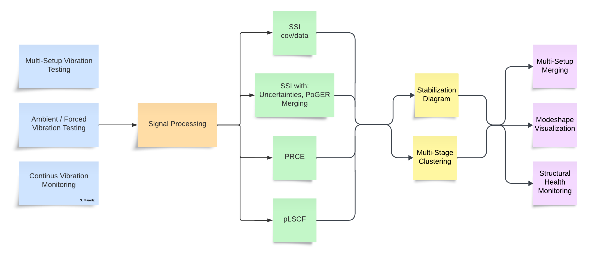

============================================
pyOMA - Operational Modal Analysis in Python
============================================

.. image:: https://readthedocs.org/projects/py-oma/badge/?version=latest
    :target: https://py-oma.readthedocs.io/en/latest/?badge=latest
    :alt: Documentation Status
.. image:: https://app.codacy.com/project/badge/Grade/4c292ef58452482097d0ae49a3ed10f9
    :target: https://app.codacy.com/gh/pyOMA-dev/pyOMA/dashboard
.. image:: https://img.shields.io/badge/License-GPLv3-blue.svg
    :target: https://www.gnu.org/licenses/gpl-3.0
    :alt: License: GPL v3
.. image:: https://zenodo.org/badge/768642315.svg
  :target: https://doi.org/10.5281/zenodo.14936576

pyOMA is an open-source Python toolbox for **Operational Modal Analysis (OMA)**,
developed by Simon Marwitz, Volkmar Zabel et al. at the Institute of Structural
Mechanics (ISM), Bauhaus-Universität Weimar.

**Operational Modal Analysis** identifies structural modal parameters — natural
frequencies, damping ratios, and mode shapes — from *output-only* ambient
vibration measurements, without requiring knowledge of the excitation forces.
This makes it the standard approach for large civil structures (bridges, towers,
floors) where artificial excitation is impractical.

pyOMA implements all major OMA algorithms and supports both interactive
exploration (Jupyter widgets, PyQt5 GUI) and fully automated batch processing
(continuous monitoring systems).

 * **Documentation:** https://py-oma.readthedocs.io
 * **Source Code:** https://github.com/pyOMA-dev/pyOMA
 * **Citing pyOMA:** https://doi.org/10.5281/zenodo.14936576

.. ── About ──────────────────────────────────────────────────────────────────

-----------
About pyOMA
-----------

pyOMA covers the full OMA workflow:

.. list-table::

      * - **Signal pre-processing**
        - Decimation, anti-aliasing filters, bandpass filtering, cross-correlation
          and power spectral density estimation (Blackman-Tukey, Welch)
      * - **System identification**
        - SSI-cov/ref (:class:`~pyOMA.core.SSICovRef.BRSSICovRef`),
          SSI-data (:class:`~pyOMA.core.SSIData.SSIData`),
          SSI-cov with variance (:class:`~pyOMA.core.VarSSIRef.VarSSIRef`),
          pLSCF (:class:`~pyOMA.core.PLSCF.PLSCF`),
          ERA (:class:`~pyOMA.core.ERA.ERA`),
          and PoGER multi-setup identification
          (:class:`~pyOMA.core.SSICovRef.PogerSSICovRef`)
      * - **Stabilization diagrams**
        - Automated pole clustering and selection
          (:class:`~pyOMA.core.StabilDiagram.StabilCluster`)
          and interactive GUI (PyQt5 or Jupyter widget)
      * - **Multi-setup OMA**
        - PoSER post-identification merging
          (:class:`~pyOMA.core.PostProcessingTools.MergePoSER`) and PoGER
          pre-identification merging
      * - **Mode shape visualization**
        - Animated 3-D mode shapes referenced to the structural geometry,
          including transformation of oblique (skewed-angle) sensor directions
          to global Cartesian coordinates

.. ── Install ────────────────────────────────────────────────────────────────

-------
Install
-------

Requirements: Python ≥ 3.9, NumPy, SciPy, Matplotlib (installed automatically).

.. code-block:: bash

   git clone https://github.com/pyOMA-dev/pyOMA.git
   cd pyOMA
   pip install -e .

**Optional extras** — choose what you need:

.. list-table::
   :widths: 40 60

   * - ``pip install -e ".[jupyter]"``
     - Interactive stabilisation and mode-shape widgets for Jupyter notebooks
   * - ``pip install -e ".[gui]"``
     - Desktop PyQt5 stabilisation diagram and mode-shape GUI
   * - ``pip install -e ".[dev]"``
     - Test suite (pytest) and documentation builder (Sphinx)
   * - ``pip install -e ".[jupyter,gui]"``
     - Both interactive frontends

.. ── Get Started ────────────────────────────────────────────────────────────

---------------
Getting started
---------------

The :doc:`getting_started` page walks through the five-step workflow (geometry →
signals → pre-processing → identification → stabilisation) with code examples.

Three worked examples are provided (see the :doc:`examples` page): single-setup
SSI, PoSER multi-setup merging, and PoGER multi-setup merging — all using the
bundled steel-frame dataset.  The :doc:`example_data` page describes that
dataset in detail.

Each example is available both as a runnable Python script and as an interactive
Jupyter notebook:

.. list-table::
   :header-rows: 1
   :widths: 40 30 30

   * - Scenario
     - Script
     - Notebook
   * - Single measurement setup
     - ``single_setup_analysis.py``
     - :doc:`_collections/single_setup_analysis`
   * - Multi-setup — PoSER (merge after identification)
     - ``multi_setup_analysis.py``
     - :doc:`_collections/multi_setup_analysis`
   * - Multi-setup — PoGER (merge before identification)
     - ``multi_setup_analysis_poger.py``
     - :doc:`_collections/multi_setup_analysis_poger`

.. ── Getting help ───────────────────────────────────────────────────────────

------------
Getting help
------------

**Before opening an issue, try the following:**

1. Check the :doc:`getting_started` page and the API reference for the class or
   method you are using.
2. Verify your input files against the :doc:`input_file_formats` page (missing
   or mis-ordered keys are a common source of ``KeyError`` / ``ValueError``).
3. Make sure channel numbers in ``channel_dofs.txt`` match the columns remaining
   *after* any ``Delete Channels`` have been removed in ``setup_info.txt``.
4. Check NumPy, SciPy, and Matplotlib version compatibility.  pyOMA requires
   NumPy ≥ 2.0; older versions will raise deprecation errors.
5. Search `GitHub Issues <https://github.com/pyOMA-dev/pyOMA/issues>`_ — your
   problem may already be reported and answered.

**Open a new issue** at https://github.com/pyOMA-dev/pyOMA/issues and include:

* a minimal reproducible example (ideally using the bundled test data),
* the full traceback,
* the output of ``pip show pyOMA numpy scipy matplotlib``.

.. ── Applications ───────────────────────────────────────────────────────────

------------
Applications
------------

pyOMA is used daily for continuous ambient vibration monitoring of a guyed
broadcasting mast (in operation since 2015) and has been applied in a range of
academic and commercial campaigns including:

.. list-table::
   :widths: 30 70

   * - Bridges
     - Long-term monitoring, seasonal modal tracking
   * - Towers and masts
     - 3D scanning laser vibrometer OMA, automated daily identification
   * - Wide-span floors
     - Multi-setup OMA to cover the full spatial extent
   * - Laboratory structures
     - Method validation, uncertainty quantification

Selected publications:

* Marwitz et al. "An Experimental Evaluation of Two Potential Improvements for 3D Laser Vibrometer Based Operational Modal Analysis". *Experimental Mechanics* 57.8, 2017.
* Marwitz et al. "Modalanalyse von Monitoringdaten eines Sendeturms". *Bautechnik* 95.4, 2018.
* Marwitz et al. "Operational Modal Analysis with a 3D Laser Vibrometer without External Reference". *IMAC 2016*, Vol. 8.
* Marwitz et al. "Automatisierte Modalanalyse und Langzeitmonitoring eines rotationssymmetrischen Turmtragwerks". *Baustatik-Baupraxis 13*, 2017.
* Marwitz et al. "Cross-Evaluation of two Measures for the Assessment of Estimated State-Space Systems in OMA". *IOMAC 2017*.
* Marwitz et al. "Betrachtung von Unsicherheiten in der Modalanalyse mit der SSI am Beispiel eines seilabgespannten Masts". *D-A-CH Tagung 2017*.
* Marwitz et al. "Modale Identifikation aus Langzeit-Dehnungsmessungen an einem Sendeturm". *VDI Baudynamik 2018*.
* Marwitz et al. "Relations between the quality of identified modal parameters and measured data obtained by structural monitoring". *ISMA 2018*.
* Zabel et al. "Bestimmung von modalen Parametern seilabgespannter Rohrmasten". *Baustatik-Baupraxis*, 2020.
* Marwitz et al. "Cross-Validation in Stochastic Subspace Identification". *IOMAC 2025*.
* Marwitz. "Quantification and Reduction of Polymorphic Uncertainties in Operational Modal Analysis". PhD Thesis, Bauhaus-Universität Weimar, 2026.

.. ── Contributing ───────────────────────────────────────────────────────────

------------
Contributing
------------

Contributions are welcome.  Please:

* Fork the repository on GitHub and open a Pull Request.
* Run the test suite before submitting: ``pip install -e ".[dev]" && pytest``
* Verify the documentation builds: ``cd doc && make clean && make html``

Good entry points for new contributors:

* **Beginner:** improve existing example scripts, add missing GUI parts for
  pre-processing and OMA modules (ipywidgets and/or PyQt5)
* **Intermediate:** add support for additional measurement file formats;
  improve documentation
* **Advanced:** new mode-shape plot backend (pyvista / mayavi); variance
  estimation for pLSCF and PRCE; correct uncertainty estimation for SSI-data
  (Döhler / IOMAC paper); implement PreGER with uncertainty bounds

.. ── Project structure ──────────────────────────────────────────────────────

-----------------
Project structure
-----------------

::

    pyOMA/
    ├── pyOMA/
    │   ├── core/
    │   │   ├── PreProcessingTools.py   # GeometryProcessor, PreProcessSignals, SignalPlot
    │   │   ├── ModalBase.py            # base class for all identification methods
    │   │   ├── SSICovRef.py            # BRSSICovRef, PogerSSICovRef
    │   │   ├── SSIData.py              # SSIData, SSIDataMC
    │   │   ├── VarSSIRef.py            # SSI with uncertainty (variance) estimation
    │   │   ├── PLSCF.py               # poly-reference Least-Squares Complex Frequency
    │   │   ├── ERA.py                 # Eigensystem Realisation Algorithm
    │   │   ├── StabilDiagram.py       # StabilCalc, StabilCluster, StabilPlot
    │   │   ├── PlotMSH.py             # ModeShapePlot
    │   │   ├── PostProcessingTools.py  # MergePoSER
    │   │   └── Helpers.py             # ConfigFile, utility functions
    │   └── GUI/
    │       ├── StabilGUI.py           # PyQt5 stabilisation diagram
    │       ├── PlotMSHGUI.py          # PyQt5 mode-shape viewer
    │       └── JupyterGUI.py          # ipywidgets for Jupyter
    ├── doc/                           # Sphinx documentation source
    ├── input_files/                   # templates for config files
    ├── scripts/                       # example scripts and notebooks
    ├── tests/                         # pytest suite + bundled example data
    └── pyproject.toml

.. ── API reference ─────────────────────────────────────────────────────────

The full API reference is available under :doc:`api_reference`:

* :doc:`preprocessing` — GeometryProcessor, PreProcessSignals, SignalPlot
* :doc:`oma` — BRSSICovRef, SSIData, VarSSIRef, PLSCF, ERA, PogerSSICovRef
* :doc:`postprocessing` — MergePoSER, StabilCalc, StabilCluster, ModeShapePlot

.. ── Indices and tables ─────────────────────────────────────────────────────

------------------
Indices and tables
------------------

* :ref:`genindex`
* :ref:`modindex`
* :ref:`search`

.. ── toctrees (control sidebar / navigation) ───────────────────────────────

.. toctree::
   :hidden:
   :maxdepth: 2

   getting_started
   input_file_formats
   examples
   api_reference

.. TODO::

    * Beginner:
        * Creating missing GUI parts for pre-processing and OMA modules (ipywidgets and/or PyQt5)
        * Improvement of documentation where needed
    * Intermediate:
        * Implementing support for various measurement file formats
    * Advanced:
        * New mode-shape plot class based on pyvista or mayavi
        * Implementation of variance estimation for PLSCF, PRCE
        * Correct uncertainty estimation for SSI-Data (Döhler / IOMAC paper)
        * Implement PreGER with uncertainty bounds
